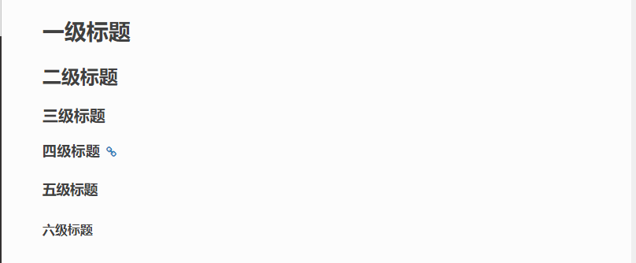

======================
reStructured使用
======================

章节标题
------------------

章节头部由下线(也可有上线)和包含标点的标题 组合创建, 其中下线要至少等于标准文本的长度。

可以表示标题的符号有 =、-、`、:、'、"、~、^、_ 、* 、+、 #、<、> 。

对于相同的符号，有上标是一级标题，没有上标是二级标题。

标题最多分六级，可以自由组合使用。

全加上上标或者是全不加上标，使用不同的 6 个符号的标题依次排列，则会依次生成的标题为H1-H6。

::

    =========
    一级标题
    =========
    二级标题
    =========

    一级标题
    ^^^^^^^^
    二级标题
    ---------
    三级标题
    >>>>>>>>>
    四级标题
    :::::::::
    五级标题
    '''''''''
    六级标题
    """"""""

|image2|

段落
-----------

段落是被空行分割的文字片段，左侧必须对齐（没有空格，或者有相同多的空格）。

缩进的段落被视为引文。

列表
-------------

符号列表(Bullet Lists)
符号列表可以使用 -、 *、+ 来表示。
不同的符号结尾需要加上空行，下级列表需要有空格缩进。

::

    - 符号列表1
    - 符号列表2

     + 二级符号列表1

     - 二级符号列表2

     * 二级符号列表3

    * 符号列表3

    + 符号列表4

- 符号列表1
- 符号列表2

  + 二级符号列表1

  - 二级符号列表2

  * 二级符号列表3

* 符号列表3

+ 符号列表4

枚举(顺序)列表(Enumerated Lists)
----------------------------------------

枚举列表算即顺序(序号)列表，可以使用不同的枚举序号来表示列表。
可以使用的枚举有：

阿拉伯数字: 1, 2, 3, ... (无上限)。
大写字母: A-Z。
小写字母: a-z。
大写罗马数字: I, II, III, IV, ..., MMMMCMXCIX (4999)。
小写罗马数字: i, ii, iii, iv, ..., mmmmcmxcix (4999)。
可以为序号添加前缀和后缀，下面的是被允许的。

. 后缀: "1.", "A.", "a.", "I.", "i."。
() 包起来: "(1)", "(A)", "(a)", "(I)", "(i)"。
) 后缀: "1)", "A)", "a)", "I)", "i)"。

枚举列表可以结合 # 自动生成枚举序号。

::

    1. 枚举列表1
    #. 枚举列表2
    #. 枚举列表3

    (I) 枚举列表1
    (#) 枚举列表2
    (#) 枚举列表3

    A) 枚举列表1
    #) 枚举列表2
    #) 枚举列表3

1. 枚举列表1
#. 枚举列表2
#. 枚举列表3

(I) 枚举列表1
(#) 枚举列表2
(#) 枚举列表3

A) 枚举列表1
#) 枚举列表2
#) 枚举列表3

代码块
----------------

.. note:: 笔记

.. important:: 重要

参考文档
------------

`reStructuredText(rst)快速入门语法说明`_

.. _`reStructuredText(rst)快速入门语法说明`: https://www.jianshu.com/p/1885d5570b37

