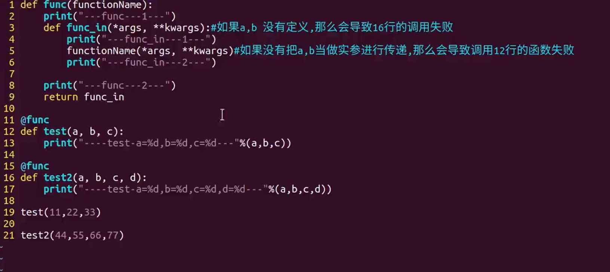

========================
5.1 装饰器
========================

::

 def func(functionName):
    print("-------func----1----")
    def func_in():
        print("--------func_in------1-----")
        functionName()
        print("--------func_in------2------------")
    print("------func-----2-------")
    return func_in

 @func
 def test():
    print('--------test-------------')

 #test = func(test)
 test()

1.装饰器执行顺序
=========================

::

 def makeBold(fn):
    def wrapped():
        print("==========1=========")
        return "<b>"+fn()+"</b>"
    return wrapped

 def makeItalic(fn):
    def wrapped():
        print("==========2=========")
        return "<i>"+fn()+"</i>"
    return wrapped

 @makeBold
 @makeItalic
 def test():
    print("==========3=========")
    return "hello world"

>>> ==========1=========
>>> ==========2=========
>>> ==========3=========
 
上面函数的调用运行流程：先装饰@makeItalic,在装饰@makeBold,运行时：先运行makeBold装饰器，makeBold中的fn指向的是，makeItalic装饰器，makeItalic中的fn指向的是test函数
 
2.装饰器进行装饰的时间
================================

::

 def w1(func):
    print("----------正在装饰---------------")
    def inner():
        print("--------验证权限--------------")
        return func()
    return inner

 @w1
 def f1():
    print("--------f1-------------")

从上面可以看出当python解释器运行到装饰器哪一行，就已经开始装饰，不用等到调用的时候才装饰，即装饰器在f1调用之前就已经进行装饰了

3.装饰器的装饰和执行顺序
==================================================

::

 def w1(func):
    print("------正在进行装饰1-------")
    def inner():
        print("-------------正在进行权限验证1-------------")
        func()
    return inner

 def w2(func):
    print("--------正在进行装饰2-------------")
    def inner():
        print("----------正在进行权限验证2------------")
        func()
    return inner
 
 # 在f1调用之前，已经进行装饰了
 @w1
 @w2
 def f1():
    print("--------f1---------")

 f1()

>>> --------正在进行装饰2-------------
>>> ------正在进行装饰1-------
>>> -------------正在进行权限验证1-------------
>>> ----------正在进行权限验证2------------
>>> --------f1---------

可以理解为包裹的包装和拆包

4.装饰器对有参和无参的函数进行装饰
==============================================================

|image1|
|image2|

装饰器的应用
===========================

1. 用类写装饰器
:::::::::::::::::::::::::::::
   实现缓存装饰器

::

 def cache(func):
    data = {}
    def wrapper(*args, **kwargs):
        key = f'{func.__name__}-{str(args)}-{str(kwargs)}'
        if key in data:
            result = data.get(key)
            print('cached')
        else:
            result = func(*args, **kwargs)
            data[key] = result
            print('calculated')
        return result
    return wrapper

查看缓存效果

::

 @cache
 def rectangle_area(length, width):
    return length*width

 rectangle_area(2, 3)
 # calculated
 # 6
 rectangle_area(2, 3)
 # cached
 # 6

装饰器的@cache 是语法糖,相当于func = cache(func), 如果这里的cache不是一个函数,而是一个类？
定义一个类 class Cache, 那么调用func = Cache(func) 会得到一个对象, 这时返回的func 其实是Cache的对象. 定义__call__方法可以将类的实例变成可调用对象, 可以像调用函数一样调用对象. 然后在__call__ 方法里调用原本的func函数就能实现装饰器. 所以Cache类也能当作装饰器使用, 并且能以@Cache 的形式使用.

把cache函数改写为Cache类:

::

 class Cache:
    def __init__(self, func):
        self.func = func
        self.data = {}

    def __call__(self, *args, **kwargs):
        func = self.func
        data = self.data
        key = f'{func.__name__}-{str(args)}-{str(kwargs)}'
        if key in data:
            result = data.get(key)
            print('cached')
        else:
            result = func(*args, **kwargs)
            data[key] = result
            print('calculated')
        return result

查看缓存效果

::

 @Cache
 def rectangle_area(length, width):
    return length * width

 rectangle_area(2, 3)
 # calculated
 # 6
 rectangle_area(2, 3)
 # calculated
 # 6

2. 装饰类的方法
::::::::::::::::::::::::::::::::::::::::

   装饰器不止能装饰函数, 也常用来装饰类的方法, 

函数写的装饰器如何装饰类的方法

::

 class Rectangle:
    def __init__(self, length, width):
        self.length = length
        self.width = width

.. |image1| image:: ./image/20190217201444.png
