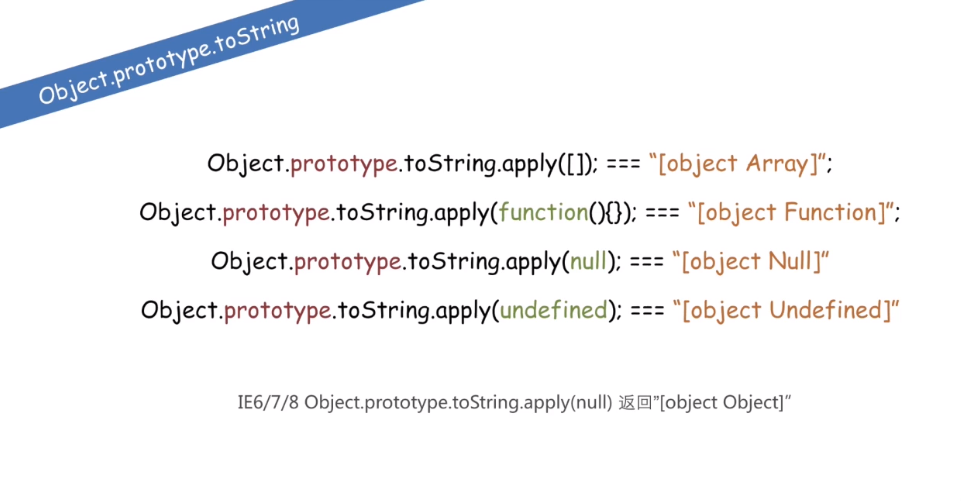
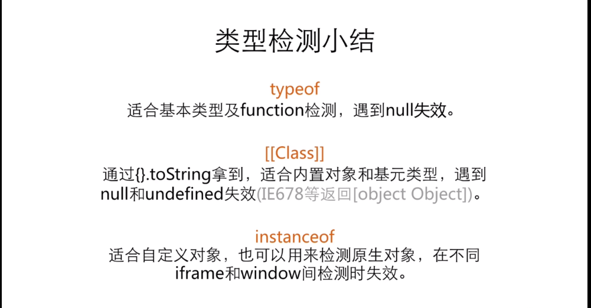
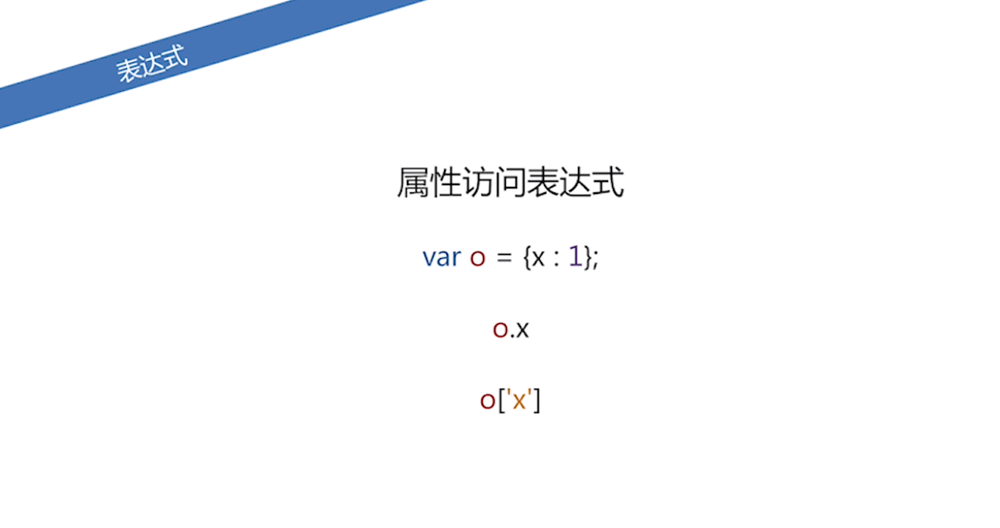
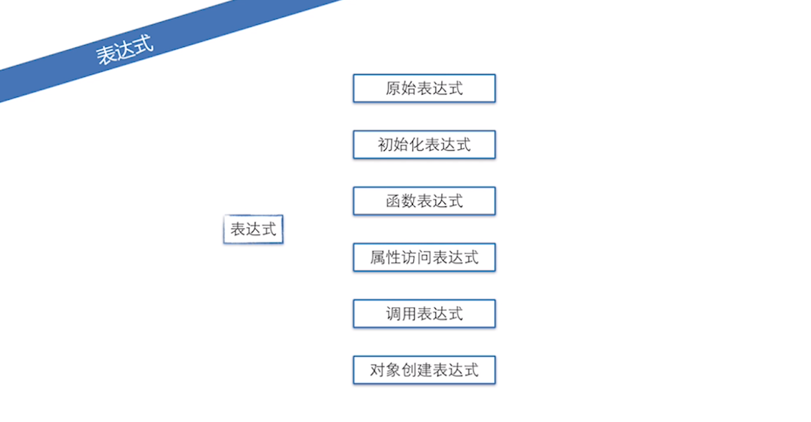
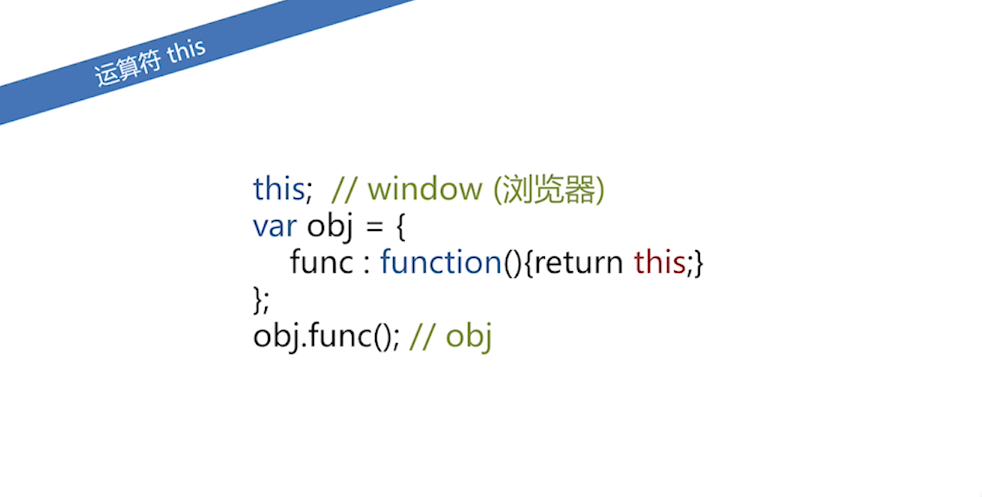

========================
100.1 JavaScript 数据类型
========================

JS 由三部分组成：

- ECMAScript：基础语法（数据类型、运算符、函数。。。。）
- BOM（浏览器对象模型）：window、location、history、navigator。。。
- DOM（文档对象模型）：div、p、span。。。

1. 数据类型
--------------

- 原始类型：number、string、boolean、null、undefined
- object ： Function、Array、Date、Regx ...

.. note::

 如果变量未声明，获取该变量的值，是会产生**语法错误**，而不是undefined

 一个变量声明，但未赋值，值默认为undefined,

 一个变量声明，并且赋值了一个undefined的值
 
 一个**对象**中，不存在的属性的值也是undefined

2.隐式转换
--------------

类型相同，同===

类型不同，尝试类型转换和比较：
null == undefined 相等
number ==string转number 1=='1.0' //true
boolean ==? 转number 1==true //true
object ==number | string 尝试对象转为基本类型 new String('hi') == 'hi' //true
其他：false

3.包对象
-----------

创建对象

::

 var student = {
     name:"test",
     grade:"5",
     say:function(){
         console.log("Hello World")
     },
     run:function(speed){
         console.log("正在以"+speed+"米/秒的速度奔跑！")
     }
 }

对象是键值对的集合：对象是由属性和方法构成；ps：对象皆属性，方法也是属性

对象属性操作
获取属性：

.. note::

 student.name   # 获取到属性的值
 student.say    # 获取一个函数

 student["name"]    # 等价于students.name
 student["say"]     # 等价于student.say

|image1|

str 是基本类型，strObj是对象类型，是sting类型对应的包装类

|image2|

::

 var a = "string";
 alert(a.length);//6
 a.t = 3;
 alert(a.t);//undefined

4.类型检测
-----------------

+ typeof
+ instanceof
+ Object.prototype.toString
+ constructor
+ duck type

|image3|

obj instanceof Object

|image4|
|image5|

|image6|

练习
------

请在index.html文件中，编写arraysSimilar函数，实现判断传入的两个数组是否相似。具体需求：

1. 数组中的成员类型相同，顺序可以不同。例如[1, true] 与 [false, 2]是相似的。

2. 数组的长度一致。

3. 类型的判断范围，需要区分:String, Boolean, Number, undefined, null, 函数，日期, window.

当以上全部满足，则返回"判定结果:通过"，否则返回"判定结果:不通过"。

::

 function arraySimialr(arr1,arr2){
    //判断边界
    if(!(arr1 instanceof Array)) || !(arr2 instanceof Array){
    return false;
    }
    //判断长度
    if(arr1.length 1== arr2.length) return false;

    var i = 0,
        n = arr1.length,
        countMap1 = {},
        countMap2 = {},
        t1,t2,
        TYPES = ['String','boolean','number','undefined','null','function','date','window'];

    for (;i<n;i++){
        t1 = typeOf(arr1[i]);
        t2 = typeOf(arr2[i]);
        if (countMap1[t1]){
            countMap1[t1]++;
        }else{
            countMap1[t1] = 1;
        }
        if (countMap2[t2]){
            countMap2[t2]++;
        }else{
            countMap2[t2] = 1;
        }
    }

    function typeOf(else){
        var r;
        if (else ==null) r = 'null';
        else if (else instanceof Array) r = 'array';
        else if (else ==window) r = 'window';
        else if (else instanceof Date) r = 'date';
        else r = typeof else;
        return r;
    }

    for (i =0,n=TYPES.length;i<n;i++){
        if (countMap1[TYPES[i]] !== countMap2[TYPES[i]]){
            return false;
        }
    }
    return true;
 }

表达式
---------

|image7|
|image8|
|image9|

调用表达式 func();
对象创建表达式 new Func(1,2); new Object;

|image10|

运算符
----------

|image11|
|image12|
|image13|

::

 window.x = 1
 'x' in window;//treu

 {} instanceof Object;//true
 typeof 100 === 'number';//true

|image14|

this运算符

|image15|

总结特殊运算符
------------------

|image16|

.. |image1| image:: ./img/20181228151757.png
.. |image2| image:: ./img/20181228152702.png
.. |image3| image:: ./img/20181228153311.png
.. |image4| image:: ./img/20181228170519.png

.. |image7| image:: ./img/20181229083516.png
.. |image8| image:: ./img/20181229083720.png

.. |image11| image:: ./img/20181229091012.png
.. |image12| image:: ./img/20181229091848.png
.. |image13| image:: ./img/20181229100108.png
.. |image14| image:: ./img/20181229100433.png

.. |image16| image:: ./img/20181229100827.png
