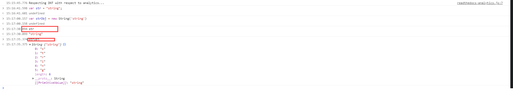
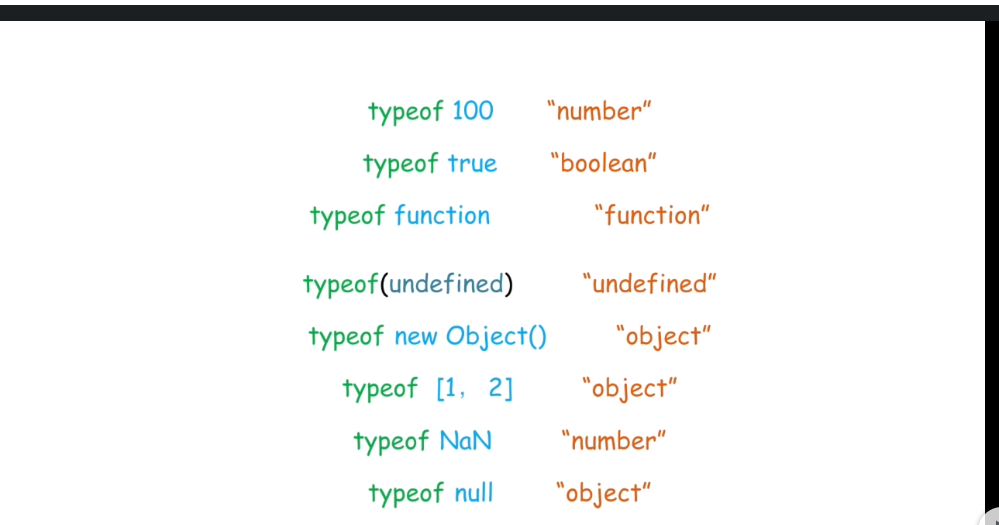

========================
100.1 JavaScript 基础
========================

1. 数据类型
--------------

- 原始类型：number、string、boolean、null、nudefined
- object ： Function、Array、Date ...

2.隐式转换
--------------

类型相同，同===

类型不同，尝试类型转换和比较：
null == undefined 相等
number ==string转number 1=='1.0' //true
boolean ==? 转number 1==true //true
object ==number | string 尝试对象转为基本类型 new String('hi') == 'hi' //true
其他：false

3.包对象
-----------

|image1|

str 是基本类型，strObj是对象类型，是sting类型对应的包装类

|image2|

::

 var a = "string";
 alert(a.length);//6
 a.t = 3;
 alert(a.t);//undefined

4.类型检测
-----------------

+ typeof
+ instanceof
+ Object.prototype.toString
+ constructor
+ duck type

|image3|

obj instanceof Object

.. |image2| image:: ./img/20181228152702.png

