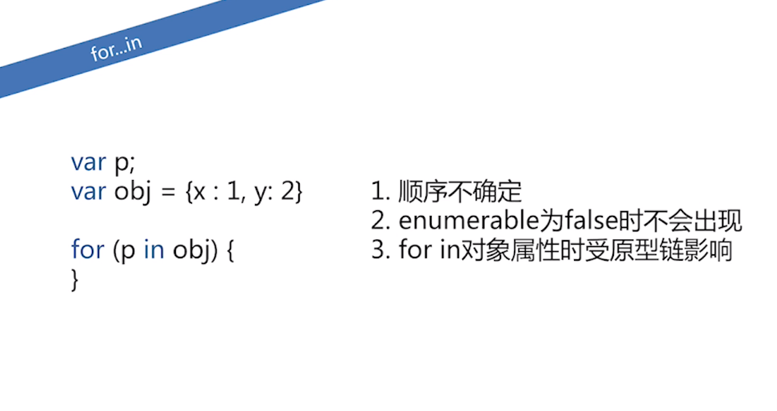
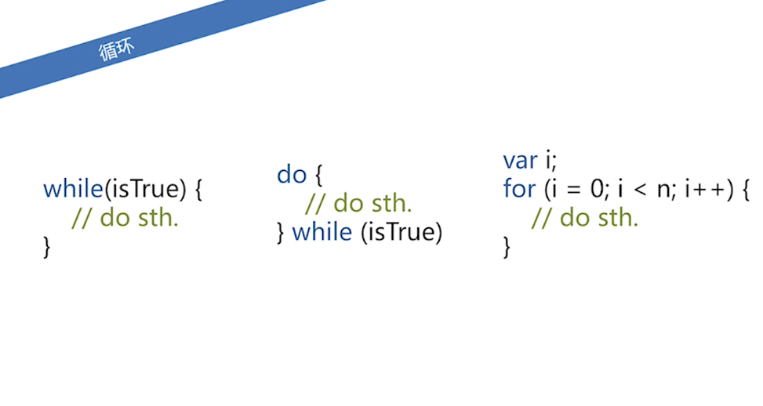
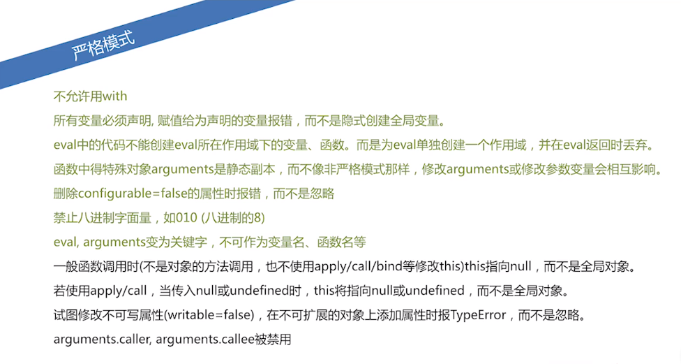

========================
100.2 JavaScript 语句
========================

1. 语句
--------------

|image1|

block
>>>>>

|image2| |image3| |image4|

var 
>>>>

::

 var a =1;
 var a = b = 1;
 var a =1,b = 1;
 function foo(){
    var a = b =1;
 }
 foo();
 console.log(typeof a); //undefined;
 console.log(typeof b); //number

try catch
>>>>>>>

::

 try{
    throw "test"
 }catch(ex){
    console.log(ex); //test
 }finally{
    console.log('finally');
 }

|image5| |image6| |image7| 

function
>>>>>>

函数申明 预先处理，函数表达式

|image8|  

for in
:::::::::::::::::::

|image9|

switch
:::::::::::::::::::::

|image10|

循环
:::::::::::::::::

|image11|

with
:::::::::::::::::

|image12|

2.严格模式
-------------

|image13| |image14| |image15| |image16|

.. |image1| image:: ./img/20181229102908.png
.. |image2| image:: ./img/20181229103055.png
.. |image3| image:: ./img/20181229103244.png
.. |image4| image:: ./img/20181229103345.png
.. |image5| image:: ./img/20181229104146.png
.. |image6| image:: ./img/20181229104422.png
.. |image7| image:: ./img/20181229104514.png
.. |image8| image:: ./img/20181229105045.png

.. |image10| image:: ./img/20181229105544.png

.. |image12| image:: ./img/20181229105834.png
.. |image13| image:: ./img/20181229110051.png
.. |image14| image:: ./img/20181229113023.png
.. |image15| image:: ./img/20181229113124.png

