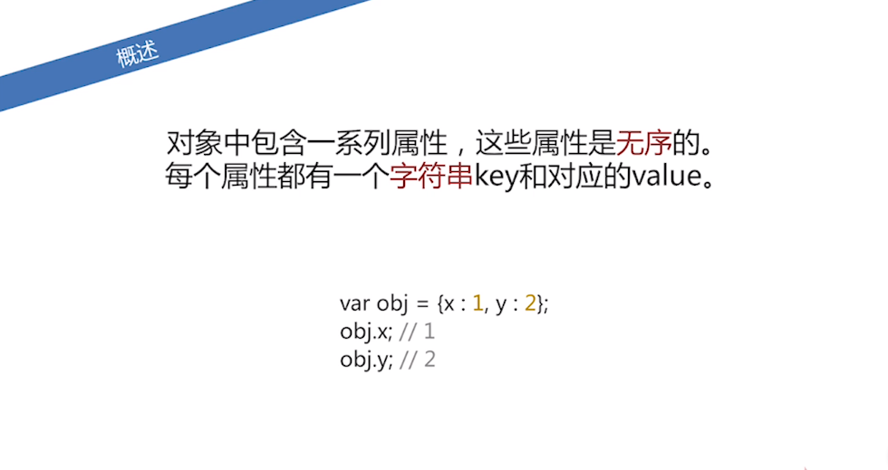
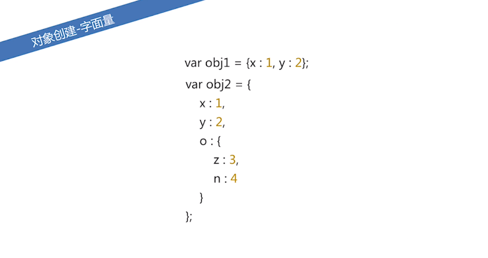
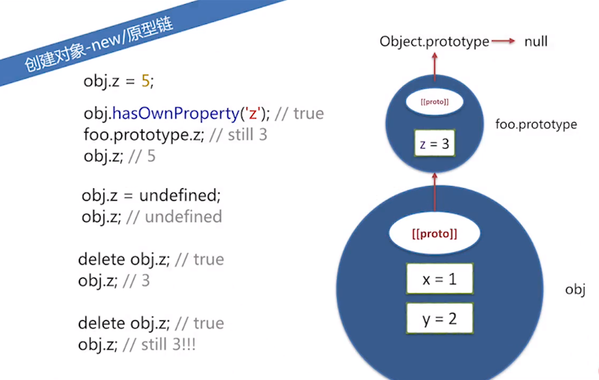

========================
100.2 JavaScript 对象
========================

1. 概述
--------------

|image1| |image2| |image3|

2. 对象创建
-----------------

字面量
>>>>>>

|image4|

new/原型链
>>>>>>>>>

|image5| |image6|

Object.creat
>>>>>>>>>>>

|image7|

.. |image2| image:: ./img/20181229114122.png
.. |image3| image:: ./img/20181229114412.png

.. |image5| image:: ./img/20181229114925.png

.. |image7| image:: ./img/20181229121925.png
.. |image8| image:: ./img/
.. |image9| image:: ./img/