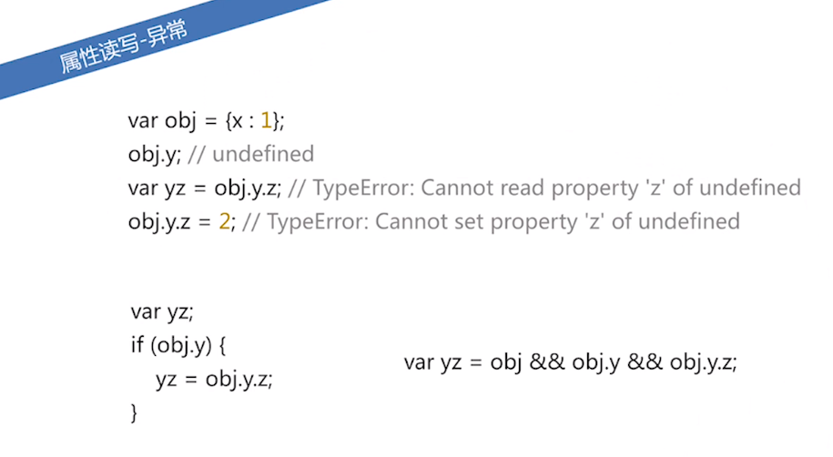
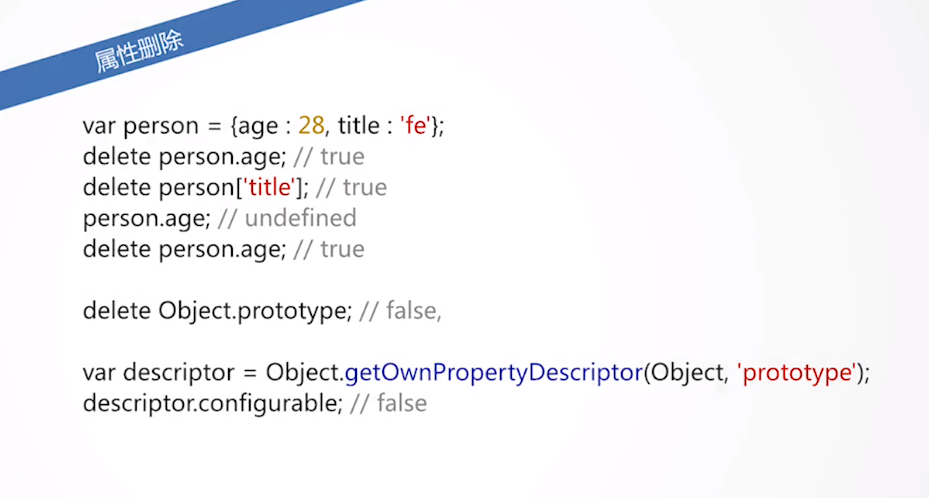
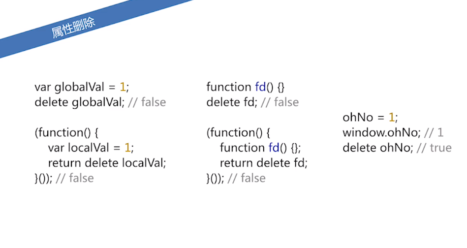

========================
100.3 JavaScript 对象
========================

1. 概述
--------------

|image1| |image2| |image3|

2. 对象创建
-----------------

字面量
>>>>>>

|image4|

new/原型链
>>>>>>>>>

|image5| |image6|

Object.creat
>>>>>>>>>>>

|image7|

2.属性操作
-------------

属性读写
>>>>>>>>>

|image8| |image9|

属性删除
>>>>>>>>>>>

|image10| |image11| 

属性检测
>>>>>>>>

.. |image1| image:: ./img/20181229114001.png
.. |image2| image:: ./img/20181229114122.png
.. |image3| image:: ./img/20181229114412.png
.. |image4| image:: ./img/20181229114518.png
.. |image5| image:: ./img/20181229114925.png
.. |image6| image:: ./img/20181229121723.png
.. |image7| image:: ./img/20181229121925.png
.. |image8| image:: ./img/20181229122736.png

