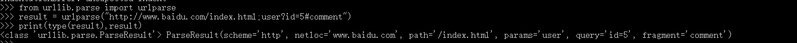
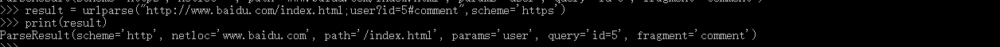
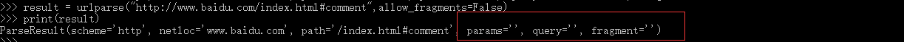

=============
11.2 Urllib
=============

Python 内置的HTTP请求库

- urllib.request 请求模块
- urllib.error 异常处理模块
- urllib.parse url解析模块
- urllib.robotparser robots.txt 解析模块

urlopen 请求
=====

GET请求
>>>>>>>>

::
 
 import urllib.request
 response = urllib.request.urlopen('http://www.baidu.com')
 print(response.read().decode('utf-8'))

POST请求
>>>>>>>>>

::

 import urllib.parse
 import urllib.request

 data = bytes(urllib.parse.urlencode({'word':'hello'}).encode('utf-8'))
 response = urllib.requset.urlopen('http://httpbin.org/post',data=data)
 print(response.read())

超时设置
>>>>>>>>>

::

 import urllib.request
 response = urllib.request.urlopen('http://httpbin.org/get',timeout=1)
 print(response.read())

::

 import socket
 import urllib.request
 import urllib.error

 try:
    response = urllib.request.urlopen('http://httpbin.org/get',timeout=0.1)
 except urllib.error.URLError as e:
    if isinstance(e.reason.socket.timeout):
        print('TIME OUT')

urlopen 响应
============

响应类型
>>>>>>>>>>

::

 import urllib.request
 response = urllib.request.urlopen('https://www.python.org')
 print(type(response))

状态码、响应头
>>>>>>>>>>>>>>>>>>>

::

 import urllib.request
 response=urllib.request.urlopen('https://www.python.org')
 print('状态码', response.status)
 print('响应头',response.getheaders())
 print('Server',response.getheader('Server'))
 print('响应体',response.read().decode('utf-8')) # 字节流byte类型，通过decode转码

Request
===========

::

 import urllib.request
 request = urllib.request.Request('https://python.org') # 定义Request对象
 response = urllib.request.urlopen(request)
 print(request.read().decode('utf-8'))

::

 from urllib import request,parse
 url = "http://httpbin.org/post"    # 构造post请求
 headers = {        # 添加headers 信息
     'User-Agent':'Mozilla/4.0 (compatible;MSIE 5.5;Windows NT)',
     'Host':'httpbin.org'
 }
 dict = {
     'name':'Gemey'
 }
 data = bytes(parse.urlencode(dict),encoding='utf-8') # 添加formdata
 req = request.Request(url=url,data=data,headers=headers,method='POST') # 构造Request
 response = request.urlopen(req)
 print(response.read().decode('utf-8'))

::

 from urllib import request,parse
 url = "http://httpbin.org/post"
 dict = {
     'name':'Gemey'
 }
 data = bytes(parse.urlencode(dict),encoding='utf-8')
 req = request.Request(url=url,data=data,method='POST')
 req.add_header('User-Agent','Mozilla/4.0(compatible;MSIE 5.5;Windows NT)')
 response = request.urlopen(req)
 print(response.read().decode('utf-8'))

Handler
========

代理
>>>>>>

::

 import urllib.request
 proxy_hander=urllib.request.Proxy_Handler({ 
     'http':'http://127.0.0.1:9743',
     'https':'https://127.0.0.1:9743'
 })
 opener = urllib.request.build_opener(proxy_hander)
 response = opener.open('http://www.baidu.com')
 print(response.read())

Cookie
>>>>>>>>

用来维持登陆状态

::

 import http.cookie,urllib.request
 cookie = http.cookiejar.CookieJar()
 handler = urllib.request.HTTPCookieProcesson(cookie)
 opener = urllib.request.build_opener(handler)
 response = opener.open('http://www.baidu.com')
 for item im cookie:
    print(item.name+"="+item.value)

存Cookie

::

 import http.cookiejar,urllib.request
 filename = 'cookie.txt'
 cookie = http.cookiejar.MozillaCookieJar(filename)
 handler = urllib.request.HTTPCookieProcesson(cookie)
 opener = urllib.request.build_opener(handler)
 response = opener.open('http://www.baidu.com')
 cookie.save(ignore_discard=True,ignore_expires=True)

::

 import http.cookiejar,urllib.request
 filename = 'cookie.txt'
 cookie = http.cookiejar.LWPCookieJar(filename)
 handler = urllib.request.HTTPCookieProcesson(cookie)
 opener = urllib.request.build_opener(handler)
 response = opener.open("http://www.baidu.com")
 cookie.save(ignore_discard=True,ignore_expires=True)

读Cookie

::

 improt http.cookiejar,urllib.request
 cookie = http.cookiejar.LWPCookieJar()
 cookie.load('cookie.txt',ignore_discard=True,ignore_expires=True)
 handler = urllib.request.HTTPCookieProcesson(cookie)
 opener = urllib.request.build_opener(handler)
 response = opener.open('http://www.baidu.com')
 print(response.read().decode('utf-8'))

异常处理
========

::

 from urllib import request,error
 try:
    response = request.urlopen("http://cuiqingcai.com/index.html")
 except error.URLError as e:
    print(e.reason)

::

 from urllib improt request,error
 
 try:
    response = request.urlopen("http://cuiqingcai.com/index.html")
 except error.HTTPError as e:
    print(e.reason,e.code,e.headers,sep='\n')
 except error.URLError as e:
    print(e.reason)
 else:
    print('Request Successfully')
 
::

 import socket
 import urllib.request
 import urllib.error

 try:
    response = urllib.request.urlopen('https://www.baidu.com')
 except urllib.error.URLError as e:
    print(type(e.reason))
    if isinstance(e.reason,socket.timeout):
        print('TIME OUT')

URL解析
=========

urlparse
>>>>>>>>>

::

 urllib.parse.urlparse(urlstring,scheme='',allow_fragments=True)

::

 from urllib.parse import urlparse

 result = urlparse("http://www.baidu.com/index.html;user?id=5#comment")
 print(type(result),result)

|image1|

::

 from urllib.parse import urlparse
 result = urlparse('www.baidu.com/index;user?id=5#comment',scheme='https')
 print(result)

|image2|

::

 from urllib.parse improt urlparse
 result = urlparse('http://www.baidu.com/index.html;user?id=5#comment',scheme='https')
 print(result)

|image3|

::

 from urllib.parse improt urlparse
 result = urlparse('http://www.baidu.com/index.html;user?id=5#comment',allow_fragments=False)
 print(result)

|image4|

::

 from urllib.parse improt urlparse
 result = urlparse('http://www.baidu.com/index.html#comment',allow_fragments=False)
 print(result)
 
|image5|

.. |image2| image:: ./image/20181215200151.png

.. |image4| image:: ./image/20181215200619.png
