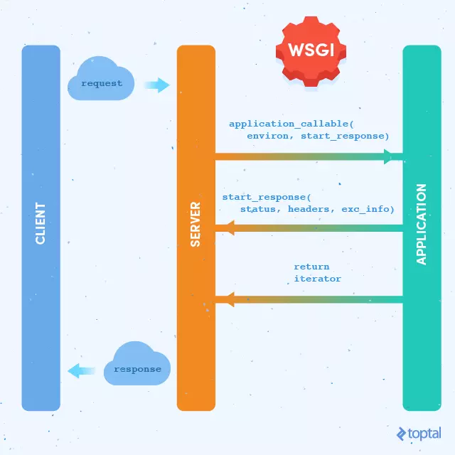

========================
Flask源码学习
========================

WSGI
--------

WSGI，全称Web Server Gateway Interface，或者Python Web Server Gateway Interface，是基于Python 定义的Web服务器和Web应用程序或框架之间的一种简单而通用的接口。WSGI接口的作用是确保HTTP请求能够转化成python应用的一个功能调用，这就是Gateway的意义所在，网关的作用就是在协议之前进行转换
WSGI接口中有一个非常明确的标准，每个Python Web应用必须是可调用callbale对象且返回一个iterator，并且实现了app(environ，start_response) 的接口，server会调用application，并传给它两个参数：environ包含了请求的所有信息，start_response是application处理完之后需要调用的函数，参数是状态码、响应头部还有错误信息。引用代码示例：

::
 
 # 1.可调用对象是一个函数
 def application(environ，start_response):
    response_body = 'The request method was %s'%environ['REQUEST_METHOD']

    # HTTP response code and message
    status = '200 OK'

    # 应答头部是一个列表，每对键值都必须是一个tuble
    response_headers = [('Content-Type','text/plain'),
                                        ('Content-Length',str(len(response_body)))]

    # 调用服务器程序提供的start_response，填入两个参数
    start_response(status,response_headers)

    # 返回必须是iterable
    return [response_body]

 class AppClass:
    '''这里的可调用对象就是 AppClass 的实例，使用方法类似于： 
        app = AppClass()
        for result in app(environ, start_response):
            do_somthing(result)
    '''
    def __init__(self):
        pass

    def __call__(self,environ,start_response):
        status = '200 OK'
        response_headers = [('Content-type','test/plain')]
        self.start(status,response_headers)
        yield "Hello world!\n"

|image0|

如上图所示，Flask框架包含了与WSGI Server通信部分和Application本身。Flask Server本身也包含了一个简单的WSGI Server（这也是为什么运行flask_source.py可以在浏览器访问的原因）用以开发测试使用。在实际的生产部署中，我们将使用apache、nginx+Gunicorn等方式进行部署，以适应性能要求。

