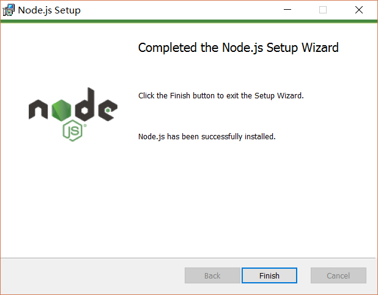
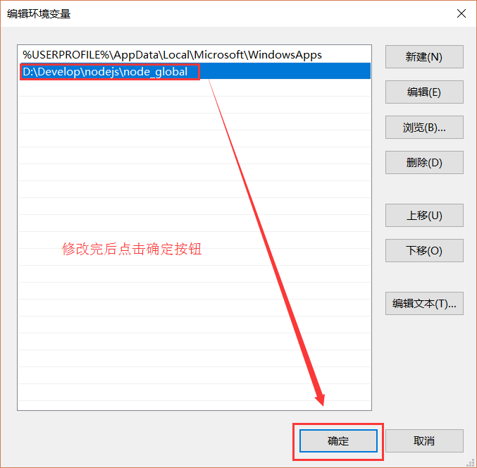

========================
24.1 node.js安装
========================

1. node.js下载
-----------------------------------------

..  image:: ./image/1.png
    :align: center
    :alt: git strucer

2.安装
-------------------

下载完成后，双击“node-v6.9.2-x64.msi”，开始安装Node.js
..  image:: ./image/2.png
    :align: center
    :alt: install node.js

..  image:: ./image/3.png
    :align: center
    :alt: install node.js

..  image:: ./image/4.png
    :align: center
    :alt: install node.js

..  image:: ./image/5.png
    :align: center
    :alt: install node.js

..  image:: ./image/6.png
    :align: center
    :alt: install node.js

至此Node.js已经安装完成，可以先进行下简单的测试安装是否成功了，后面还要进行环境配置
在键盘按下【win+R】键，输入cmd，然后回车，打开cmd窗口

..  image:: ./image/8.png
    :align: center
    :alt: install node.js

安装完后的目录如下图所示：

..  image:: ./image/9.png
    :align: center
    :alt: install node.js

3 配置环境变量
-------------------------

说明：这里的环境配置主要配置的是npm安装的全局模块所在的路径，以及缓存cache的路径，之所以要配置，是因为以后在执行类似：npm install express [-g] （后面的可选参数-g，g代表global全局安装的意思）的安装语句时，
会将安装的模块安装到【C:\Users\用户名\AppData\Roaming\npm】路径中，占C盘空间。
例如：我希望将全模块所在路径和缓存路径放在我node.js安装的文件夹中，则在我安装的文件夹【D:\Develop\nodejs】下创建两个文件夹【node_global】及【node_cache】如下图：

..  image:: ./image/10.png
    :align: center
    :alt: install node.js

创建完两个空文件夹之后，打开cmd命令窗口，输入

npm config set prefix "D:\Develop\nodejs\node_global"
npm config set cache "D:\Develop\nodejs\node_cache"

..  image:: ./image/11.png
    :align: center
    :alt: install node.js

进入环境变量对话框，在【系统变量】下新建【NODE_PATH】，输入【D:\Develop\nodejs\node_global\node_modules】，将【用户变量】下的【Path】修改为【D:\Develop\nodejs\node_global】

..  image:: ./image/12.png
    :align: center
    :alt: install node.js

..  image:: ./image/13.png
    :align: center
    :alt: install node.js

..  image:: ./image/14.png
    :align: center
    :alt: install node.js

4 测试
---------------------------------------

配置完后，安装个module测试下，我们就安装最常用的express模块，打开cmd窗口，
输入如下命令进行模块的全局安装：

npm install express -g     # -g是全局安装的意思

..  image:: ./image/16.png
    :align: center
    :alt: install node.js
