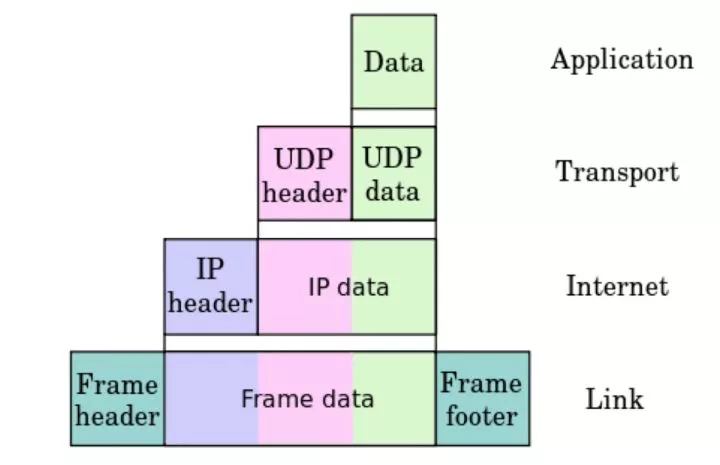
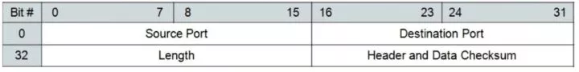
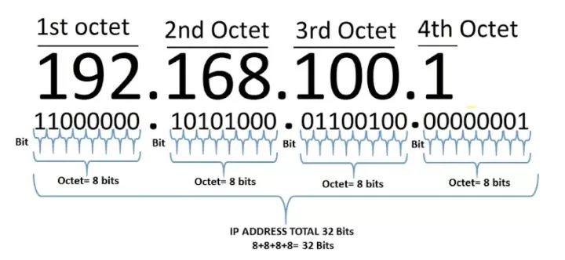
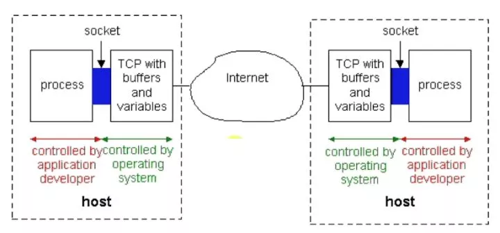

========================
30.3 Socket入门之前
========================

TCP协议
============================

.. important:: 端口号只有整数，范围是0到65535 2的16次方

.. important:: - 80端口分配给HTTP服务
               - 21端口分配给FTP服务

.. note:: **netstat -an** 查看端口状态

Socket
===========================

7层网络模型-OSI
>>>>>>>>>>>>>>>>>>>>>>>>>>>>>

- 基础层：物理层（Physical）、数据链路层（Datalink）、网络层（Network)
- 传输层（Transport)：TCP-UDP协议层、Socket
- 高级层：会话层（Session)、表示层（Presentation）、应用层（Application)

|image1| |image2|

SOcket基础
>>>>>>>>>>>>>>>>>>>>>>>>>>>>>>>

- 简单来说是IP地址与端口的结合协议（RFC793）
- 一种地址与端口的结合描述协议
- TCP/IP协议的相关API的总称；是网络Api的集合实现
- 涵盖了：Stream Socket/Datagram Socket
- 作用：

 + 在网络传输中用于唯一标示两个端点之间的链接
 + 端点：包括（IP+Port)
 + 4个要素：客户端地址、客户端端口、服务器地址、服务器端口

- TCP

 + TCP是面向连接的通信协议
 + 通过三次握手建立连接，通讯完成时要拆除连接
 + 由于TCP是面向连接的所以只能用于端到端的通讯

- UDP

 + UDP是面向无连接的通讯协议
 + UDP数据包括目的端口号和源端口号信息
 + 由于通讯不需要连接，所以可以实现广播发送，并不局限于端到端

- TCP/IP协议中，两个进程间通信的主要模式为：CS模型
- 主要目的：协同网络中的计算机资源、服务模式、进程间数据共享
- 常见的：FTP、SMTP、HTTP

报文、协议、Mac地址
>>>>>>>>>>>>>>>>>>>>>>>>>>>>>>>>>>>>>>>>>>>

- 报文

 + 报文段是指TCP/IP协议网络传输过程中，起着路由导航作用
 + 用以查询各个网络路由网段、IP地址、交换协议等IP数据包
 + 报文段充当整个TCP/IP协议数据包的导航路由功能
 + 报文在传输过程中会不断地封装成分组、包、帧来传输
 + 封装方式就是添加一些控制信息组成的首部，即报文头

- 传输协议
 + 协议顾名思义，一种规定，约束
 + 约定大于配置，在网络传输中依然适用；网络的传输流程是健壮的稳定的，得益于基础的协议构成
 + 简单来说：A->B的传输数据，B能识别，反之B->A的传输数据A也能识别，这就是协议

- Mac地址

 + Media Access Control或者Medium Access Control
 + 意译为媒体访问控制，或称为物理地址、硬件地址
 + 用来定义网络设备的位置
 + 形如：44-45-53-54-00-00；与身份证类似

IP，端口，远程服务器
>>>>>>>>>>>>>>>>>>>>>>>>>>>>>>>>>>>>>

- 互联网协议地址（英语：Internet Protocol Address，又译为网际协议地址），缩写为IP地址（英语：IPAddress)
- 是分配给网络上使用网际协议（英语：Internet Protocol，IP)的设备的数字标签
- 常见的IP地址分为IPV4与IPv6两大类
- IP地址由32位二进制数组成，常以XXX.XXX.XXX.XXX形式表现，每组XXX代表小于或等于255的10进制数
- 如：208.80.152.2
- 分为A、B、C、D、E五大类，其中E类属于特殊保留地址

- IPV4

 + 总数量：4,294,967,296个（即232）：42亿个；最终于2011年2月3日用尽
 - 如果主机号是全1，那么这个地址为直接广播地址
 * IP地址“255.255.255.255"为受限广播地址

- IPV6

 + 总共有128位长，IPV6地址的表达形式，一般采用32个十六进制数。也可以想象为1632个
 - 由两个逻辑部分组成：一个64位的网络前缀和一个64位的主机地址，主机地址通常根据物理地址自动生成，叫做EUI-64（或者64-位扩展唯一标识）
 * 2001:0db8:85a3:0000:1319:8a2e:0370:7344
 - IPv4转换为IPv6一定可行，IPv6转换为IPv4不一定可行

- 端口

 + 如果把IP地址比作一间房子，端口就是出入这间房子的门或者窗户
 - 在不同门窗户后有不同的人，房子中的用户与外界交流的出口
 * 外界鸽子（信息）飞到不同窗户也就是给不同的人传递信息
 - 0到1023号端口以及1024到49151号端口都是特殊端口

|image3|

- 计算机之间依照互联网传输层TCP/IP协议的协议通信，不同的协议都对应不同的端口
- 49152到65535号端口属于“动态端口”范围，没有端口可以被正式地注册占用

|image4| |image5|

- UDP

 + 它一旦把应用程序发给网络层的数据发送出去，就不保留数据备份
 - UDP在IP数据报的头部仅仅加入了复用和数据校验（字段）
 * 发送端生产数据，接收端从网络中抓取数据
 -结构简单、无校验、速度快、容易丢包、可广播
 - DNS、TFTP、SNMP
 - 视频、音频、普通数据（无关紧要数据）
 |image6|
 - 英语：User Datagram Protocol，缩写为UDP
 - 一种用户数据报协议，又称用户数据报文协议
 - 是一个简单的面向数据报的传输层协议，正式规范为RFC 768
 - 用户数据协议、非连接协议
 - 不可靠

- UDP包最大长度

 + 16位->2字节存储长度信息
 - 2^16-1=64K-1=65536-1=65535
 * 自身协议占用：32+32位=64位=8字节
 - 65535-8=65507 byte

UDP Api
DatagramSocket

前面3个参数指定buf的使用区间

后面2个参数指定目标机器地址与端口（仅仅在发送时有效）

用于接收与发送UDP的类

负责发送某一个UDP包，或者接收UDP包

不同于TCP，UDP并没有合并到Socket APl中

没有服务器端和客户端

DatagramSocket)创建简单实例，不指定端口与IP

DatagramSocket(int port)创建监听固定端口的实例（接收数据的端口）

DatagramSocket(int port,InetAddress localAddr)创建固定端口指定lP的实例（当计算机有多个IP地址存在时）

receive(DatagramPacket d):接收

send(DatagramPacket d):发送

setSoTimeout(int timeout):设置超时，毫秒

close() 关闭，释放资源

DatagramPacket(bytel] bufint offset,int length,InetAddress address,int port)

SocketAddress相当于InetAddress+Port

setData(bytel[] bufint ofset,int length)

setData(bytel[l buf)

setLength(int length)

getData()、getOffset()、getLength()

setAddress(InetAddress iaddr)、setPort(int iport) 发送时有效，接收时set操作是由系统完成的

getAddress()、getPort()

setSocketAddress(SocketAddress address)

getSocketAddress()

UDP单播、广播、多播
高频次广播有可能导致局域网或者某段网络的信息带宽被占满
|image7|
IP地址类别
|image8|
广播地址

255.255.255.255为受限广播地址

C网广播地址一般为：XXX.XXX.XXX.255（192.168.1.255）

D类IP地址为多播预留
|image9|
ipv4的地址本来就是用32位来表示的,分成4个8位来书写, 所以ipv4和地址是可以和32位unsigned int

广播地址运算

IP：192.168.124.7

子网掩码：255.255.255.0

网络地址：192.168.124.0

广播地址：192.168.124.255

例子二

IP：192.168.124.7

子网掩码：255.255.255.192

网络地址：192.168.124.0

广播地址：192.168.124.63

255.255.255.192->11111111.11111111.11111111.11000000

可划分网段：2/2=4个

0~63、64~127、128~191、192~255

192.168.124.63

广播通信问题
主机一：192.168.124.7，子网掩码：255.255.255.192

主机二：192.168.124.100，子网掩码：255.255.255.192

主机一广播地址：192.168.124.63

主机二广播地址：192.168.124.127

因为两个主机的广播地址不同，所以互相收不到对方的消息

局域网搜索Demo（略）
UDP接收消息并回送功能实现

UDP局域网广播发送实现

UDP局域网回送消息实现

TCP（Transmission Control Protocol）
TCP是传输控制协议；是一种面向连接的、可靠的、基于字节流的传输层通信协议，由IETF的RFC793定义

与UDP一样完成第四层传输层所指定的功能与职责

三次握手、四次挥手

具有校验机制、可靠、数据传输稳定
|image10|
作用

聊天消息传输、推送

单人语音、视频聊天等

几乎UDP能做的都能做，但需要考虑复杂性、性能问题

限制：无法进行广播，多播等操作

- TDP Api
 - socket（):创建一个Socket
 + bind)：绑定一个Socket到一个本地地址和端口上
 * connect（)：发起连接,连接到远程套接字
 - accept():接受一个新的连接，阻塞等待
 - write（)：把数据写入到Socket输出流
 - read（)：从Socket输入流读取数据
|image11|
|image12|

.. |image1| image:: ./image/19022501.webp
.. |image2| image:: ./image/19022502.webp
.. |image3| image:: ./image/i9022503.webp

.. |image5| image:: ./image/19022505.webp

.. |image7| image:: ./image/19022507.webp
.. |image8| image:: ./image/19022508.webp

.. |image10| image:: ./image/19022510.webp
.. |image11| image:: ./image/19022511.webp

