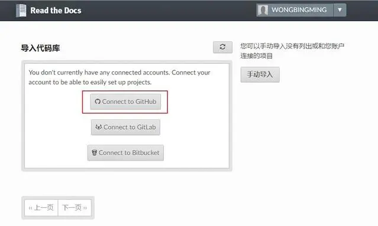
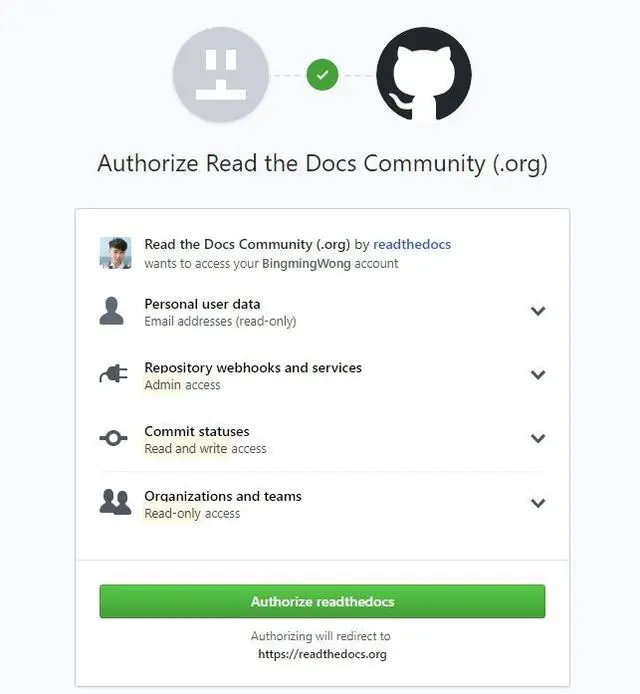
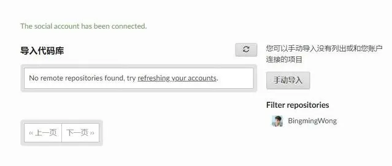
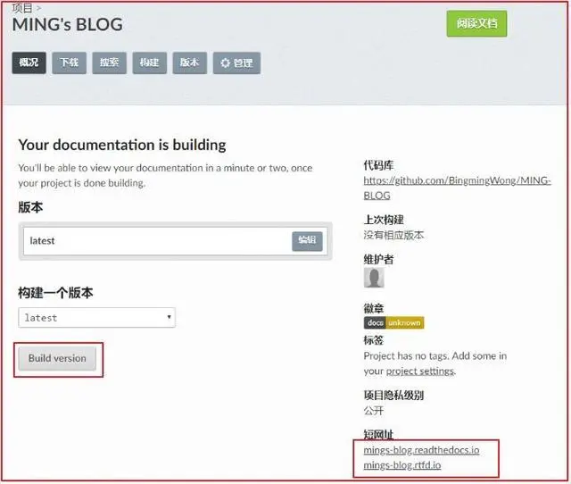
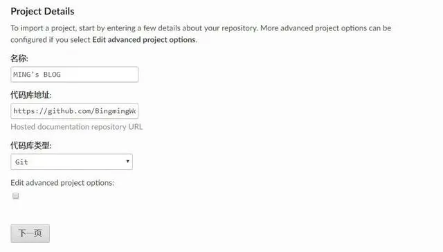

===============================
博客搭建
===============================

使用技术
---------

采用Markdown+Pandoc+Sphinx+GitHub+ReadtheDocs

-  Markdown：书写文档
-  Pandoc：格式转化
-  Sphinx：生成网页
-  GitHub：托管项目
-  ReadtheDocs：发布网页

成品展示
--------

(https://mblogs.readthedocs.io/en/latest/)为例。

这是首页。显示了你所有的文章索引。 |image0|

这是我的导航栏。是不是结构很清晰，很方便索引。 

看完这些你是不是也很想拥有这样一个博客呢？

只要你认真往下看，30分钟搭建这样一个博客不在话下。

安装Sphinx
----------

安装Python3.65

安装Python工具包

>>> pip install sphinx sphinx-autobuild sphinx_rtd_theme

或者安装 \ ``sphinx-doc``\

>>> pip install sphinx-doc

初始化

Sphinx 推荐使用 sphinx-quickstart，这是一个设置向导

>>> sphinx-sphinx-apidoc  sphinx-autogen  sphinx-build   sphinx-quickstart

.. code:: shell

    # 先创建一个工程目录:F:\\mkdocs
    $ cd F:\\mkdocs

    $ sphinx-quickstart

执行这个命令\ ``sphinx-quickstart``\ 的时候，会让你输入配置。除了这几个个性化配置，其他的都可以按照默认的来。

::

    > Project name: MING's BLOG
    > Author name(s): MING
    > Project release []: 1.0
    > Project language [en]: zh_CN

完了后，就可以看见创建的工程文件。

::

    F:\mkdocs
    (mkdocs) λ ls -l
    total 5
    -rw-r--r-- 1 wangbm 1049089 610 Jun 23 16:57 Makefile
    drwxr-xr-x 1 wangbm 1049089   0 Jun 23 16:57 build/
    -rw-r--r-- 1 wangbm 1049089 817 Jun 23 16:57 make.bat
    drwxr-xr-x 1 wangbm 1049089   0 Jun 23 16:57 source/

    F:\mkdocs
    (mkdocs) λ tree
    卷 文档 的文件夹 PATH 列表
    卷序列号为 0002-B4B9
    F:.
    ├─build
    └─source
        ├─_static
        └─_templates

解释下这些文件夹：

-  build：文件夹，当你执行make html的时候，生成的html静态文件都存放在这里。
-  source：文件夹：你的文档源文件全部应全部放在source根目录下。
-  Makefile：编译文件。完全不用管。
-  make.bat：WIN脚本。你也不用管。

配置及扩展
---------------------

Sphinx 的配置文件是 ``source\conf.py``

exts配置文件，我做了哪些事：

 -  配置主题
 -  支持LaTeX
 -  支持中文检索

由于扩展模块会用到一些第三方依赖包，需要你去包装它。requirements.txt
同样我也给你准备好了，在压缩包里有。

你只要执行这个命令，即可安装。

::

    pip install -r requirements.txt -i https://pypi.douban.com/simple/

撰写文章
---------------------

万事俱备，接下来要写文档了。

在source目录下，新增文件
how\_to\_be\_a\_rich\_man.rst（至于什么是rst格式呢，请自行搜索引擎噢）

文件内容如下

::

    第一章 如何成为有钱人
    ======================

    1.1 财富继承法
    ---------------------

    有个有钱的老爸。

    1.2 财富共享法
    ---------------------

    有个有钱的老婆。

写好文档后，千万记得要把这个文档写进，目录排版里面。

排版配置文件是 ``source\index.rst``\ ，千万要注意中间的空行不可忽略。

.. code:: python

    .. toctree::
       :maxdepth: 2
       :caption: Contents:

       how_to_be_a_rich_man

然后删除这几行

::

    Indices and tables
    ==================

    * :ref:`genindex`
    * :ref:`modindex`
    * :ref:`search`

然后执行\ ``make html`` 生成html静态文件。

.. code:: shell

    F:\mkdocs
    (mkdocs) λ make html
    Running Sphinx v1.7.4
    loading translations [zh_CN]... done
    loading pickled environment... done
    building [mo]: targets for 0 po files that are out of date
    building [html]: targets for 2 source files that are out of date
    updating environment: [extensions changed] 2 added, 0 changed, 0 removed
    reading sources... [100%] index
    looking for now-outdated files... none found
    pickling environment... done
    checking consistency... done
    preparing documents... done
    writing output... [100%] index
    generating indices... genindex
    writing additional pages... search
    copying static files... done
    copying extra files... done
    dumping search index in English (code: en) ... done
    dumping object inventory... done
    build succeeded.

    The HTML pages are in build\html.

执行完了后，你可以发现原先的build，不再是空文件夹了。

我们点进去 build/html，打开index.html 
|image01|

点击 我们刚写的暴富指南。
|image02| 

托管项目
--------

看到网页的那一刻是不是相当激动。

不过别激动，这只是本地的，我们需要将其发布在线上。

这里我将工程文件，托管在\ ``GitHub``\ 上，然后由\ ``Read the Docs``\ 发布。

在托管之前呢，我们需要准备工作。在mkdocs根目录下，添加文件\ ``.gitignore``\ （聪明的你，肯定知道这是什么），内容如下

::

    build/
    .idea/
    *.pyc

接下来，在你的GitHub上新建一个仓库。然后把mkdocs这个目录下的所有文件都提交上去。步骤很简单，这里就不细讲。

发布上线
--------

托管完成后，我们要发布它，让别人可以访问。

你需要先去 ``Read the Docs`` 注册下帐号。

关联一下GitHub 

|image1|

|image2|

导入代码库。填好与你对应的信息。 

|image3|

|image6|

构建网页后。右下方，你可以看见你的在线地址。   
|image4|

这里要提醒一下的是，Sphinx的文档格式，默认是 rst
格式，如果你习惯了使用Markdown来写文章，可以使用 Pandoc
客就搭这个神器转换一下。

这里给出格式转换命令。

::

    pandoc -V mainfont="SimSun" -f markdown -t rst hello.md -o hello.rst

或者你也可以在Sphinx上添加支持Markdown渲染的扩展模块。这需要你自己去折腾了。

到这里，属于你的个人博客就搭建好了，快去试一下吧。

最后，整个项目的源码和模块包我都放在公众号后台，请关注后，回复「Sphinx」领取。

参考文档
----------
- `Sphinx配置MarkDown解析`_
- `Sphinx使用手册(部分汉化)`_
- `搭建参考文章`_
- `RST中文文档 <https://www.wenjiangs.com/doc/sypeug9v>`_ 

.. _`Sphinx配置MarkDown解析`: http://www.sphinx-doc.org/en/master/usage/markdown.html
.. _`Sphinx使用手册(部分汉化)`: http://www.pythondoc.com/sphinx/contents.html
.. _`搭建参考文章`: https://www.xncoding.com/2017/01/22/fullstack/readthedoc.html

--------------

.. |image0| image:: ./img/1.png
.. |image01| image:: ./img/2.png
.. |image02| image:: ./img/3.png

.. .. figure:: http://ovzwokrcz.bkt.clouddn.com/18-10-28/9446245.jpg
..    :alt: 关注公众号，获取最新文章
