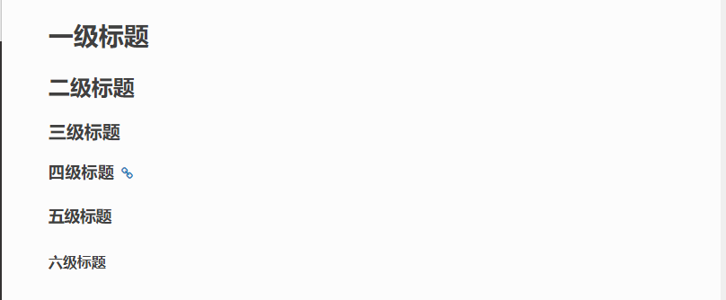

======================
reStructured使用
======================

章节标题
------------------

章节头部由下线(也可有上线)和包含标点的标题 组合创建, 其中下线要至少等于标准文本的长度。

可以表示标题的符号有 

::

  ! " # $ % & ' ( ) * + , - . / : ; < = > ? @ [ ] ^ _ ` { | } ~

对于相同的符号，有上标是一级标题，没有上标是二级标题。

标题最多分六级，可以自由组合使用。

全加上上标或者是全不加上标，使用不同的 6 个符号的标题依次排列，则会依次生成的标题为H1-H6。

::

    ================
    一级标题（Title）
    ================

    二级标题（Section）
    -------------------

    三级标题（Subsection）
    =====================

    四级标题（Subsubsection）
    ^^^^^^^^^^^^^^^^^^^^^^^^^

    五级标题（Paragraph）
    """"""""""""""""""""""

    六级标题（Subparagraph）
    ***************************

|image2|


1. 段落
-----------

段落是被空行分割的文字片段，左侧必须对齐（没有空格，或者有相同多的空格）。

缩进的段落被视为引文。

3. 列表
-------------

符号列表(Bullet Lists)

符号列表可以使用 \-、 \*、\+ 来表示。

不同的符号结尾需要加上空行，下级列表需要有空格缩进。

::

    - 符号列表1
    - 符号列表2

     + 二级符号列表1

     - 二级符号列表2

     * 二级符号列表3

    * 符号列表3

    + 符号列表4


- 符号列表1
- 符号列表2

  + 二级符号列表1

  - 二级符号列表2

  * 二级符号列表3

* 符号列表3

+ 符号列表4


表格
----------


.. code-block:: text

  .. csv-table::
      :header: table-header-1, table-header-2 // 表头
      :widths: 5, 20 // 两列的宽度

      "table-column-1", "table-column-2"
      // 通过双引号包含数据，用逗号隔开，每个逗号都是一列，作为csv-table内容的补充，需要注意前面空格对齐

  .. csv-table:: table-name // 表格名称
      :header: table-header-1, table-header-2 // 表头
      :widths: 5, 15 // 两列的宽度

  // 表格内容↓，用逗号分隔，双引号为内容
      "head", "header-content"
      "body", "body-content"


枚举(顺序)列表(Enumerated Lists)
----------------------------------------

枚举列表算即顺序(序号)列表，可以使用不同的枚举序号来表示列表。
可以使用的枚举有：

阿拉伯数字: 1, 2, 3, ... (无上限)。
大写字母: A-Z。
小写字母: a-z。
大写罗马数字: I, II, III, IV, ..., MMMMCMXCIX (4999)。
小写罗马数字: i, ii, iii, iv, ..., mmmmcmxcix (4999)。
可以为序号添加前缀和后缀，下面的是被允许的。

. 后缀: "1.", "A.", "a.", "I.", "i."。
() 包起来: "(1)", "(A)", "(a)", "(I)", "(i)"。
) 后缀: "1)", "A)", "a)", "I)", "i)"。

枚举列表可以结合 # 自动生成枚举序号。

::

    1. 枚举列表1
    #. 枚举列表2
    #. 枚举列表3

    (I) 枚举列表1
    (#) 枚举列表2
    (#) 枚举列表3

    A) 枚举列表1
    #) 枚举列表2
    #) 枚举列表3

1. 枚举列表1
#. 枚举列表2
#. 枚举列表3

(I) 枚举列表1
(#) 枚举列表2
(#) 枚举列表3

A) 枚举列表1
#) 枚举列表2
#) 枚举列表3

代码块
----------------

.. note:: 笔记

.. important:: 重要

行内标记（Inline Markup）
---------------------------------


+--------------------------------+----------------------------+--------------------------------+
| reST文本                       | 解析渲染结果               | 注解                           |
+================================+============================+================================+
| ``*emphasis*``                 | *emphasis*                 | 通常渲染成斜体, 与Markdown相同 |
+--------------------------------+----------------------------+--------------------------------+
| ``**emphasis**``               | **emphasis**               | 通常渲染成粗体, 与Markdown相同 |
+--------------------------------+----------------------------+--------------------------------+
| ```interpreted text```         | `interpreted text`         | 强调解释.                      |
+--------------------------------+----------------------------+--------------------------------+
| ````inline literal````         | ``inline literal``         | 常用于行内代码, 与Markdown相同 |
+--------------------------------+----------------------------+--------------------------------+
| A ``:sub:`xxx```               | A :sub:`xxx`               | 下标(subscript)                |
+--------------------------------+----------------------------+--------------------------------+
| A ``:sup:`xxx```               | A :sup:`xxx`               | 上标(superscript)              |
+--------------------------------+----------------------------+--------------------------------+
| ``:guilabel:`Action```         | :guilabel:`Action`         | GUI labels                     |
+--------------------------------+----------------------------+--------------------------------+
| ``:kbd:`Ctrl+Shift```          | :kbd:`Ctrl+Shift`          | Key-bindings                   |
+--------------------------------+----------------------------+--------------------------------+
| ``:menuselection:`A-->B-->C``` | :menuselection:`A-->B-->C` | 菜单选择                       |
+--------------------------------+----------------------------+--------------------------------+


- 上标: ``E = mc\ :sup:`2```  ->     E = mc\ :sup:`2`

- 下标: ``H\ :sub:`2`\ O``  ->    H\ :sub:`2`\ O

- 行居中加粗  ``.. centered:: 居中加粗``

.. centered:: 居中加粗

- 提示
  
:abbr:`提示 (这是提示信息)`


水平线学习
---------------------------

水平线需要4个-符号即可。下面的那个就是。

 \- \- \- \-

水平线需要4个-符号即可。上面的那个符号就是。


脚注参考
-----------------------------

脚注参考 [5]_

.. [5] 这是对应的注记信息

自动脚注

脚注参考 [#]_，这是第二个脚注 [#]_。

.. [#] 这是第一个注记的信息
.. [#] 这是第二个注记的信息

引用
-------------------------

引用参考，[cit2002]_。

.. [cit2002] 这个地方应该介绍下cit2002的。


超链接
----------------------------

这个是一个超链接， 百度_.

..  _百度: http://www.baidu.com

新的超链接

`新浪 <https://www.sina.com.cn/>`_ 


注释
-----------------------------

这个一个注释的样例

..  

        所以这个块虽然缩进了，但并不是“丢失”的。


Sphinx 插件列表
----------------------------

以下是一些常见的 Sphinx 插件，按功能分类。

1. **主题扩展 (Themes)**

  - `sphinx_rtd_theme`: Read the Docs 网站的默认主题。   
  - 安装: ``pip install sphinx_rtd_theme``
  
  - `alabaster`: 一个简单且优雅的主题。
  - 安装: ``pip install alabaster``
  
  - `sphinx_material`: 基于 Material Design 的主题。
  - 安装: ``pip install sphinx_material``

2. **图像处理扩展 (Image Processing)**

  - `sphinxcontrib-inkscapeconverter`: 将 SVG 图像转换为其他格式（如 PNG）。
  - 安装: ``pip install sphinxcontrib-inkscapeconverter``

  - `sphinx.ext.imgconverter`: 自动将图像转换为适合文档输出的格式。

3. **API 文档生成 (API Documentation Generators)**
   
  - `sphinx.ext.autodoc`: 自动提取 Python 模块中的文档字符串并生成 API 文档。
  -  配置: `extensions = ['sphinx.ext.autodoc']`
  
  - `sphinx.ext.napoleon`: 支持 Google 和 NumPy 风格的 docstring。
  -  安装: `pip install sphinxcontrib-napoleon`
  
  - `sphinx.ext.viewcode`: 允许在文档中显示源代码。
  - 配置: `extensions = ['sphinx.ext.viewcode']`
  
  - `sphinx-autodoc-typehints`: 将类型提示集成到自动文档生成中。
  - 安装: `pip install sphinx-autodoc-typehints`

4. **文档内容管理 (Content Management)**
   
  - `sphinx.ext.todo`: 显示文档中的 TODO 项目。
  -  配置: `extensions = ['sphinx.ext.todo']`
  - `sphinx.ext.index`: 创建文档的索引。
  -  配置: `extensions = ['sphinx.ext.index']`
  - `sphinx.ext.mathjax`: 启用 MathJax 来渲染数学公式。
  -  配置: `extensions = ['sphinx.ext.mathjax']`
  - `sphinx.ext.extlinks`: 为 URL 或外部链接定义快捷方式。
  -  配置: `extensions = ['sphinx.ext.extlinks']`

5. **搜索与增强功能 (Search & Enhancements)**
   
  - `sphinx.ext.search`: 增强的搜索功能，支持索引和文档搜索。
  - `sphinxcontrib-mermaid`: 集成 Mermaid 图表，用于绘制流程图、序列图等。
  -  安装: `pip install sphinxcontrib-mermaid`

6. **文档版本管理 (Versioning)**
   
  - `sphinx-versioning`: 版本控制 Sphinx 文档，支持文档的多版本管理。
  -  安装: `pip install sphinx-versioning`

7. **格式转换 (Conversion Tools)**
   
  - `recommonmark`: 支持 Markdown 格式的文档。
  -  安装: `pip install recommonmark`
  - `myst-parser`: 解析 MyST Markdown 格式的扩展。
  -  安装: `pip install myst-parser`

8. **测试和文档质量 (Testing & Documentation Quality)**
   
  - `sphinx.ext.coverage`: 提供代码覆盖率信息，用于文档的自动测试。
  -  配置: `extensions = ['sphinx.ext.coverage']`
  - `sphinxcontrib-spelling`: 自动检查拼写错误。
  -  安装: `pip install sphinxcontrib-spelling`

9.  **Sphinx 构建增强 (Build Enhancements)**
    
  - `sphinx.ext.timecode`: 显示文档生成的时间戳。
  - `sphinx-multiversion`: 允许为不同版本的文档生成独立的构建。
  - 安装: `pip install sphinx-multiversion`

10. **其他常见扩展**
    
  - `sphinx.ext.coverage`: 报告代码覆盖率信息。
  - `sphinxcontrib-bibtex`: 用于处理 BibTeX 引用。
  -  安装: `pip install sphinxcontrib-bibtex`


.. _use_reStructuredText:

参考文档
---------------

`reStructuredText(rst)快速入门语法说明 <https://www.jianshu.com/p/1885d5570b37>`_

`reStructuredText 简介 <https://wklchris.github.io/blog/reStructuredText/Advance.html#id3>`_

`LVGL <https://docs.lvgl.io/master/index.html>`_

`野火sphinx规范 <https://ebf-contribute-guide.readthedocs.io/zh_CN/latest/rest-syntax/base-syntax.html>`_

`Sphinx+reStructuredText：变量的使用 <https://www.jianshu.com/p/21e090355c96>`_




