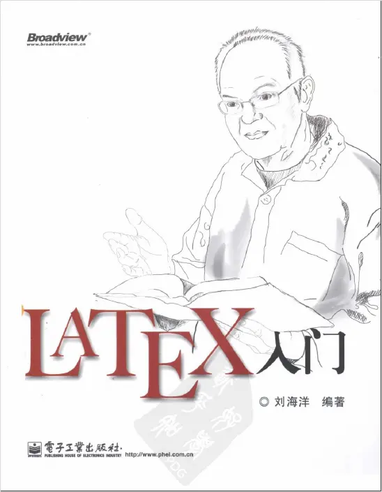

=============================
3. reStructuredText PDF
=============================

使用 Sphinx+reStructuredText 生成PDF时，默认经过的是 reStructuredText 文件 > tex 文件 > PDF 文件的过程，即使用的是 latex engine进行PDF的输出。因此，在自定义输出的PDF样式时，很多的调整都是基于 latex 语法。在此，推荐一本latex的入门书籍，刘海洋的《Latex入门》。

Q1: 如何修改文档页面尺寸为 A4？
---------------------------------------------

使用 Sphinx+reStructuredText 生成PDF时，默认的页面大小是 Letter 尺寸（Letter是美国比较普遍使用的一个纸张尺寸，具体的尺寸为 8.5英寸 * 11英寸）。而国内则普遍使用A4纸张尺寸，具体尺寸为 210mm297mm，折合英制为 8.268英寸11.69英寸。因此，会出现需要调整文档页面尺寸为A4的现象。

如何调整：

1. 在默认的 Sphinx 环境（默认是 source 文件夹）中找到 conf.py 文件。
2. 在 latex_elements 中添加 papersize: a4paper 行。如下示例：

.. code-block:: python

   latex_elements:{
      # The paper size ('letterpaper' or 'a4paper').
      'papersize': 'a4paper'
   }

3. 此外，还可以进一步设置页面版心的尺寸，即页面内容显示区域离上下左右边距的大小。
以上下左右边距设置为 2cm 为例，在 ``latex_elements`` 添加以下命令：

.. code-block:: python

   latex_elements{
      'geometry': r' \usepackage[left=2cm,right=2cm,top=2cm,bottom=2cm]{geometry}',

   }

Q2: 如何调整PDF字体？
---------------------------------------------

默认情况下，Sphinx使用 latex engine 输出PDF，默认使用 Times，Helvetica，和 Courier 字体组合。因此，如果需要调整字体，可以使用 latex 中 font 包的用法，引入心仪的目标字体。

.. note::

   需要注意的是，font 宏包的使用仅适用于latex 发布引擎为 xelatex 和 lualatex 的情况。而Sphinx默认的latex engine为 pdflatex.

如需自定义发布出来的PDF的字体，可以参考下面的操作：

1. 使用 fc-list 命令，或者到 系统 font 目录下查看已有字体，确保系统中含有目标字体。

2. 在默认的 Sphinx 环境（默认是 source 文件夹）中找到 conf.py 文件。

3. 使用 xelatex latex 发布引擎。

.. code-block:: python

   # 使用 xelatex 发布引擎
   latex_engine = 'xelatex'

4. 在 latex_elements 使用 fontpkg 行。如下示例：
   
.. code-block:: python

   latex_elements:{
      # 引入 fontpkg 包
      'fontpkg': r'''
      \setmainfont{DejaVu Sans}
      \setsansfont{DejaVu Sans}
      \setmonofont{DejaVu Sans Mono}
      '''
   }

Q3: 如何自定义页眉页脚
---------------------------------------------

使用latex ``fancyhdr`` 宏包进行设置。

1. 在 conf.py 文件中，找到 latex_elements。
2. 根据需求设置页眉页脚。
   
.. note::

   ``fancyhdr`` 宏包的详细命令和参数，可参考刘海洋《Latex入门》一书中 P145-149。

Q4: 调整目录样式
---------------------------------------------

使用 latex ``tocloft`` 宏包进行设置。

1. 在 conf.py 文件中，找到 ``latex_elements``。
2. 以调整目录中制表位宽度为例，命令行示例如下：

.. code-block:: python

   latex_elements:{
      'premable': r'''
      usepackage{tocloft}
      \renewcommand\cftfignumwidth{4em} 
      \renewcommand\cfttabnumwidth{4em} 
      \renewcommand\cftsecnumwidth{4em} 
      \renewcommand\cftsubsecnumwidth{6em} 
      \renewcommand\cftparanumwidth{6em} 
   '''
   }

Latex ``tocloft`` 宏包中，对应的命令和参数如下：

.. figure:: ./images/p04/tocloft\ 宏包命令和参数.png
   :alt: tocloft 宏包命令和参数
   :align: center

.. note::

   详细设置，可参考刘海洋《Latex入门》一书的 P162-165。

Q5: 如何让每节（section）从新的页面开始？
---------------------------------------------

1. 在 conf.py 文件中，找到 ``latex_elements``。
2. 增加以下命令行：

.. code-block:: python

   latex_elements:{
      'premable': r'''
      newcommand{\sectionbreak}{\clearpage}
      '''
   }

Q6： 如何修改全文文本对齐方式为左对齐？
---------------------------------------------
默认输出的PDF中，正文文本对齐方式默认设置为“两端对齐”，但在英文文档中，有时候不太友好。所以，一般需要将文本对齐修改为“左对齐”。

1. 在 conf.py 文件中，找到 ``latex_elements``。
2. 增加以下命令行：

.. code-block:: python

   latex_elements:{
      'premable': r'''
      \usepackage[document]{ragged2e}
   '''
   }

Q7： 如何修改PDF中标题级的颜色？
---------------------------------------------

在 conf.py 文件中找到 ``latex_elements`` 中使用 sphinxsetup 调整。
除标题颜色外，也可以修改其他标语的颜色。以下仅为示例：

.. code-block:: python

   latex_elements = {
    'preamble': r"""
      \usepackage{sphinx}
      \sphinxsetup{TitleColor={rgb}{0,0.3,0.6}}  % 设置标题颜色
      \sphinxsetup{noteBorderColor={rgb}{0.7,0.7,0.7}}  % 设置提示框颜色
      \sphinxsetup{verbatimwithframe=false}  % 禁用代码框架
      \sphinxsetup{InnerLinkColor={rgb}{0,0.4,0.8}}  % 设置内链颜色
      \sphinxsetup{footerLinkColor={rgb}{0,0.4,0.8}}  % 设置页脚链接颜色
      \sphinxsetup{warningBorderColor={rgb}{1,0,0}}  % 设置警告框颜色
      \sphinxsetup{cautionBorderColor={rgb}{1,0,0}}  % 设置小心框颜色
      """
   }

使用sphinxsetup修改其他样式

.. code-block:: python

   latex_elements['sphinxsetup'] = r"""
   verbatimwithframe=false,  % 禁用代码框架
   listingvisibility=visible  % 设置代码高亮可见
   """

Q8： 为什么在发布的PDF中有些图片会错位（和文本不在同一页面）？
------------------------------------------------------------------------------

Latex 中图片和表格的排版使用浮动体（float）设置在页面的位置，默认设置为 ``htbp`` (**here此处**, **top页顶**, **bottom页底**, **page独立一页**)。因此，在当前页面无法放下图片时，图片可能会悬浮到下一页面，可能造成图片和文本的“错位”。

为了让图片严格出现在对应的文本处，可以做如下修改：

1. 在 conf.py 文件中找到 ``latex_elements``，并添加以下命令行：

.. code-block:: python

   figure_align= 'H',

figure_align 设置

在 Sphinx 中，你可以使用 figure_align 配置项来控制图像在 LaTeX 输出中的对齐。它通常有以下几种设置：

- ``'H'``: 强制图像放置在当前位置（LaTeX float 包的 H 选项）。

- ``'t'``: 图像放置在页面顶部。

- ``'b'``: 图像放置在页面底部。

- ``'c'``: 图像放置在页面的中央。

Sphinx 默认已经使用了 float 包，因此 'H' 可以正常工作。但如果出现问题，可以在 LaTeX 前导部分手动加载 float 包：

.. code-block:: python

   latex_elements = {
      'preamble': r"""
      \usepackage{float}
      """
   }

Q8： 跨页表格，如何让表头在每页开头重复显示？
------------------------------------------------------------------------------

对于行数较多的大型表格，如需每页开始都重复显示标题行，可以为表格添加 class: longtable 的属性即可。
以CSV表格为例，写法如下：

.. code-block:: restructuredtext

   .. csv-table:: Table Title
      :class: longtable

Q9：如何让图片和表格自动编号？
-------------------------------------------------------
在 conf.py 文件中设置 ``numfig = True``：

.. code-block:: python

   numfig = True

RST文件中，使用 ``numref`` 引用图片和表格。 “%” 为占位符，代表自动编号。

.. code-block:: restructuredtext

   图片引用：:numref:`Fig. %s <figure-label>`
   表格引用：:numref:`Table %s <table-label>`

另外，

1. 可以在 conf.py 文件修改 ``numfig_format`` 设置图片和表格的自动编号的标签文本。默认：
   
- ``Fig. %s`` 为 figure的自动编号
  
- ``Table %s`` 为 table的自动编号
 
- ``Listing %s`` 为code-block的自动编号
  
- ``Section %s`` 为 section的自动编号
 
2. 可以在 conf.py 文件修改 ``numfig_secnum_depth`` 设置起始编号。默认起始编号为 “1”。

.. _reStructuredText_PDF:

参考文档
--------------------

`Sphinx+reStructuredText：调整PDF样式 \(上） <https://www.jianshu.com/p/ea257e8b1893>`_

`Sphinx+reStructuredText：调整PDF样式 \(下） <https://www.jianshu.com/p/7afe7b6b1493>`_
