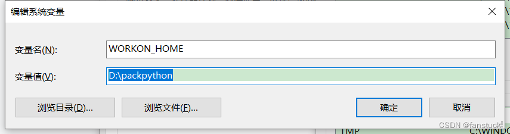

========================================
3. Python虚拟环境
========================================

pip
===============

升级 pip
>>>>>>>>>>

>>> pip install --upgrade pip
>>> pip install -U pip

查询软件包
>>>>>>>>>>>>>>

查询当前环境安装的所有软件包

>>> pip list

查询pypi上含有某个名字的包

>>> pip search pkg 

查询当前环境中可升级的包

>>> pip list --outdated

查询一个包的详细内容

>>> pip show pkg

下载软件包
>>>>>>>>>>>>>>>>>>>>

不安装软件包的情况下载软件到本地

>>> pip download --destination-directory /local/wheels -r requirements.txt 

指定目录中安装软件包,不从pypi上安装

>>> pip install --no-index --find-links=/local/wheels -r requirements.txt 

从下载的包中,自己构建生成wheel文件

>>> pip install wheel
>>> pip wheel --wheel-dir=/local/wheels -r requirements.txt

安装软件
>>>>>>>>>>>>>>>>>

.. code-block:: shell
   :linenos: 

   # 下载非二进制的包
   pip download --no-binary=:all: pkg 

   # 安装非二进制的包
   pip install pkg --no-binary

安装用户私有软件包
>>>>>>>>>>>>>>>>>>>>

>>> pip install --user pkg

升级软件包
>>>>>>>>>>>>>

>>> pip install --upgrade pkg 

Virtualenv、Virtualenvwrapper、Pyenv、

Virtualenv 
============================

::

 virtualenv -p /usr/bin/python3/bin/python3 venv 
 source /venv/bin/active
 deactivate
 
Virtualenvwrapper 
=============================

::

 pip install virtualenvrapper 
 # 配置.barshrc 
 export WORKON_HOME=$HOME/.virtualenvs  # 指定目录
 export VIRTUALENVWRAPPER_PYTHON=/usr/bin/python
 export VIRTUALENVWRAPPER_VIRTUALENV_ARGS='--no-site-packages' # 隔离系统site-packages 
 export PIP_VIRTUALENV_BASE=$WORKON_HOME
 export PIP_RESPECT_VIRTUALENV=true
 if [[ -r /usr/local/bin/virtualenvwrapper.sh ]]; then
    source /usr/local/bin/virtualenvwrapper.sh
 else
    echo "WARNING: Can't find virtualenvwrapper.sh"
 fi 

 # 创建使用虚拟环境
 mkvirtualenv your_project #创建
 rmvitualenv your_project #删除
 workon  # 列出项目
 workon your_project # 进去某个项目

Pyenv 
==============================

::

 pip install pyenv 
 pip install pyenv-virtualenv 
 pip install pyenv-virtualenvwrapper 

 # 配置.barshrc 
 # ---pyenv---
 export PATH="$HOME/.pyenv/bin:$PATH"
 eval "$(pyenv init -)"
 eval "$(pyenv virtualenv-init -)"

 # pyenv 使用方式
 pyenv install -l # 获取安装列表
 pyenv install 3.7.1 # 安装python3.7
 pyenv global 3.7.1 # 设置全局python
 pyenv virtualenv test-pyenv-venv # 创建虚拟包
 pyenv activate test-pyenv-venv # 进入虚拟环境
 pyenv deactivate  # 退出

pipenv 
===============================

安装pipenv
-------------------

使用命令 ``pipenv install``，可在当前目录下创建 ``Pipfile`` 、 ``Pipfile.lock`` 文件，在虚拟环境目录下新增一个虚拟环境

**Pipfile** 文件： 用于保存项目的python版本、依赖包等相关信息 。

.. literalinclude:: ./code/p03/Pipfile
    :encoding: utf-8
    :language: text
    :linenos:

- source 用来设置仓库地址，即指定镜像源下载虚拟环境所需要的包
- packages 用来指定项目依赖的包，可以用于生产环境和生成requirements文件
- dev-packages 用来指定开发环境需要的包，这类包只用于开发过程，不用与生产环境。
- requires 指定目标Python版本
- scripts 添加自定义的脚本命令，并通过 pipenv run + 名称 的方式在虚拟环境中执行对应的命令 。
- pipenv run django 相当于 执行命令 pipenv run python manage.py runserver 0.0.0.0:8080
- Pipfile 文件可以复制到其他项目内，通过执行 ``pipenv install`` 命令， 根据这个 Pipfile 文件生成虚拟环境和依赖包的安装

指定目录存放虚拟环境
存放虚拟环境的目录默认指定是 ``C:\Users\zhengpanone\.virtualenvs`` 目录下。
如果不想将虚拟环境的安装目录放到C盘，也可以指定目录存放，只需要在电脑系统环境变量下面添加工作目录：

|image1|

指定python版本创建虚拟环境
>>>>>>>>>>>>>>>>>>>>>>>>>>>

>>> pipenv install --python +版本号

可指定python版本创建虚拟环境。
也可以通过：

>>> pipenv install --two           # 创建指定python2.x版本的虚拟环境
>>> pipenv install --three         # 创建指定python3.x版本的虚拟环境

安装到dev环境
>>>>>>>>>>>>>>>>>>>>

安装调试工具、性能测试工具、python语法工具，这些内容仅在本地环境有用，生产环境不需要这些。

比如单元测试相关的包unittest、pytest，只在开发阶段有用，为了和生产环境的包区分开来，可以通过命令 pipenv install --dev + 包名将其归类到【dev-packages】下。

例如安装pytest到开发环境

>>> pipenv install --dev pytest

:: 

 pip install pipenv

 pip install pipenv --user [username] 
 # -user 指定将pipenv 安装在该用户主目录下

 # 创建虚拟环境

 cd project1
 pipenv install

 # pipenv install 
 # 是安装已经提供的包并将它们加入到Pipfile中（Pipfile是python包依赖文件，列出了项目中所有包的依赖，
 # 这是pipenv相当大的创新，对应的是Pipfile.lock文件）(Pipfile和Pipfile.lock两个文件互相配合，完成虚拟环境的管理工作。)，这里同时创建了项目的虚拟环境。

pipenv install的时候有三种逻辑：

 - 如果目录下没有Pipfile和Pipfile.lock文件，表示创建一个新的虚拟环境；
 - 如果有，表示使用已有的Pipfile和Pipfile.lock文件中的配置创建一个虚拟环境；
 - 如果后面带诸如django这一类库名，表示为当前虚拟环境安装第三方库。

::

 # 激活虚拟环境
 pipenv shell
 # 退出虚拟环境
 exit
 # 安装和卸载第三方库
 pipenv install flask
 pipenv uninstall flask
 pipenv uninstall --all # 在项目所在虚拟环境中卸载所有包，并在Pipfile文件移除包名
 pipenv uninstall --all --dev	# 在项目所在虚拟环境中卸载所有dev环境的包，并在Pipfile文件移除包名
 pipenv update flask
 pipenv update  # 在项目所在虚拟环境中更新所有包
 pipenv update --outdated # 在项目所在虚拟环境中查看已过期的包的信息
 pipenv lock # 根据项目所在虚拟环境的Pipfile文件生成/更新Pipfile.lock文件中的依赖包信息
 pipenv --where # 查看项目位置
 pipenv --venv	 # 查看虚拟环境位置
 pipenv --py # 查看虚拟环境python解释器位置
 pipenv graph	 #查看依赖包信息
 pipenv --rm # 删除虚拟环境

 pipenv run python your_script.py #pipenv虚拟环境运行python命令

pipenv 具有下列的选项：

.. code-block:: shell
   :linenos:

   pipenv
   Usage: pipenv [OPTIONS] COMMAND [ARGS]...

   Options:
   --update         更新Pipenv & pip
   --where          显示项目文件所在路径
   --venv           显示虚拟环境实际文件所在路径
   --py             显示虚拟环境Python解释器所在路径
   --envs           显示虚拟环境的选项变量
   --rm             删除虚拟环境
   --bare           最小化输出
   --completion     完整输出
   --man            显示帮助页面
   --three / --two  使用Python 3/2创建虚拟环境（注意本机已安装的Python版本）
   --python TEXT    指定某个Python版本作为虚拟环境的安装源
   --site-packages  附带安装原Python解释器中的第三方库
   --jumbotron      不知道啥玩意....
   --version        版本信息
   -h, --help       帮助信息

pipenv 可使用的命令参数：

.. code-block:: text
   :linenos:

   Commands:
      check      检查安全漏洞
      graph      显示当前依赖关系图信息
      install    安装虚拟环境或者第三方库
      lock       锁定并生成Pipfile.lock文件
      open       在编辑器中查看一个库
      run        在虚拟环境中运行命令
      shell      进入虚拟环境
      uninstall  卸载一个库
      update     卸载当前所有的包，并安装它们的最新版本

