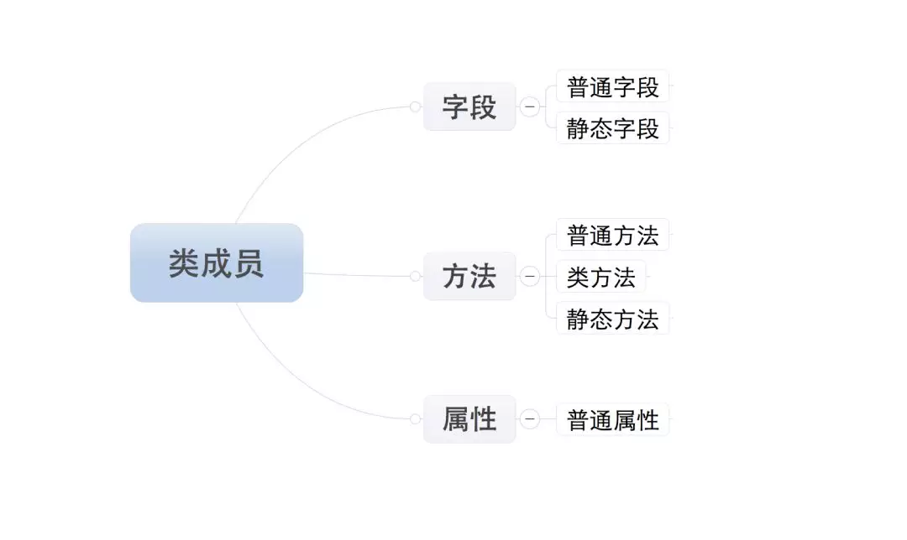

========================
1. 类的定义
========================

类的成员
=====================

类的成员分为三大类：字段、方法和属性
|image1|

**注：所有成员中，只有普通字段的内容保存对象中，即：根据此类创建了多少对象，在内存中就有多少个普通字段。而其他的成员，则都是保存在类中，即：无论对象的多少，在内存中只创建一份。**

1、字段
=====================

字段包括：普通字段和静态字段，它们在定义和使用中有所区别，最本质的区别是内存中保存的位置不同。

- 普通字段属于对象
- 静态字段属于类

::

 class Province:
    
    country = '中国'    # 静态字段，保存在类中

    def __init__(self, name):
        
        self.name = name # 普通字段，保存在对象中

 # 直接访问普通字段
 obj = Province('河北省')
 print(obj.name)

 # 直接访问静态字段
 Province.country

普通字段需要通过对象来访问，静态字段通过类访问，可以看出普通字段和静态字段的归属是不同的。存储方式类似下图
|image2|

类寻找属性或方法的流程：
实例.__dict__  > 类.__dict__ > 类.__getattr__ > 类.__getattribute__

- 静态字段在内存中只保存一份
- 普通字段在每个对象中都要保存一份

应用场景： 通过类创建对象时，如果每个对象都具有相同的字段，那么就使用静态字段

2、方法
===================

方法包括：普通方法、静态方法和类方法，三种方法在内存中都属于类，区别在于调用方式不同

- 普通方法：由**对象**调用；至少一个self参数，执行普通方法时，自动将调用该方法的对象赋值给self;
- 类方法：由**类**调用；至少一个cls参数；执行类方法时，自动将调用该方法的类赋值给cls;
- 静态方法：由**类**调用；无默认参数；

::

 class Foo:
    
    def __init__(self,name):
        self.name = name
    
    def ord_func(self):
        """定义普通方法，至少有一个self参数"""
        print("普通方法")

    @classmethod
    def class_func(cls):
        """定义类方法，至少有一个cls参数"""
        print("类方法")

    @staticmethod    
    def static_func():
        """定义静态方法，无默认参数"""
        print("静态方法")

 # 调用普通方法 
 f = Foo()
 f.ord_func()

 # 调用类方法 
 Foo.class_func()

 # 调用静态方法
 Foo.static_func()

|image3|

**相同点**：对于所有的方法而言，均属于类（非对象）中，所以，在内存中也只保存一份。
**不同点**：方法调用者不同、调用方法时自动传入的参数不同。

3、属性
================

Python中的属性其实是普通方法的变种，对于属性有两个知识点：

- 属性的基本使用
- 属性的两种定义方式

1、属性的基本使用
----------------------------

::

 class Foo:
    def func(self):
        pass
    
    # 定义属性
    @property
    def prop(self):
        pass

 # 属性调用
 foo_obj = Foo()

 foo_obj.func()
 foo_obj.prop # 调用属性

参考文档
================

Python那些事：https://mp.weixin.qq.com/s/xw0qQRzG8qqdfMbQgj62pg

