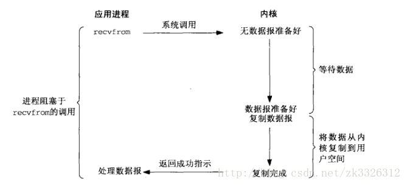

# 1. 异步IO

## 并发并行


- **并发** 一个时间段,有几个程序在同一个`cpu`上运行,但是任意时刻只有一个程序在`cpu`上运行。即多个任务交替执行

- **并行** 任意时刻点上,有多个程序同时运行在多个`cpu上。即多个任务同时执行

- **同步** 指代码调用IO操作时,必须等待IO操作才能完成返回的调用方式。

- **异步** 指代码调用IO操作时,不必等IO操作完成就返回的调用方式。

- **阻塞** 指调用函数时候当前线程被挂起

- **非阻塞** 指调用函数时候当前线程不会被挂起,而是立即返回

CPU的速度远远快于磁盘、网络等IO。在一个线程中，CPU执行代码的速度极快，然而，一旦遇到IO操作，如读写文件、发送网络数据时，就需要等待IO操作完成，才能继续进行下一步操作。这种情况称为同步IO。

在IO操作的过程中，当前线程被挂起，而其他需要CPU执行的代码就无法被当前线程执行了。

因为一个IO操作就阻塞了当前线程，导致其他代码无法执行，所以我们必须使用多线程或者多进程来并发执行代码，为多个用户服务。每个用户都会分配一个线程，如果遇到IO导致线程被挂起，其他用户的线程不受影响。

多线程和多进程的模型虽然解决了并发问题，但是系统不能无上限地增加线程。由于系统切换线程的开销也很大，所以，一旦线程数量过多，CPU的时间就花在线程切换上了，真正运行代码的时间就少了，结果导致性能严重下降。

由于我们要解决的问题是CPU高速执行能力和IO设备的龟速严重不匹配，多线程和多进程只是解决这一问题的一种方法。

另一种解决IO问题的方法是异步IO。当代码需要执行一个耗时的IO操作时，它只发出IO指令，并不等待IO结果，然后就去执行其他代码了。一段时间后，当IO返回结果时，再通知CPU进行处理。

按普通顺序写出的代码实际上是没法完成异步IO的：

```python
do_some_code()
f = open('/path/to/file', 'r')
r = f.read() # <== 线程停在此处等待IO操作结果
# IO操作完成后线程才能继续执行:
do_some_code(r)
```

所以，同步IO模型的代码是无法实现异步IO模型的。

异步IO模型需要一个消息循环，在消息循环中，主线程不断地重复“读取消息-处理消息”这一过程：

```python
loop = get_event_loop()
while True:
    event = loop.get_event()
    process_event(event)
```

消息模型其实早在应用在桌面应用程序中了。一个GUI程序的主线程就负责不停地读取消息并处理消息。所有的键盘、鼠标等消息都被发送到GUI程序的消息队列中，然后由GUI程序的主线程处理。

消息模型是如何解决同步IO必须等待IO操作这一问题的呢？当遇到IO操作时，代码只负责发出IO请求，不等待IO结果，然后直接结束本轮消息处理，进入下一轮消息处理过程。当IO操作完成后，将收到一条“IO完成”的消息，处理该消息时就可以直接获取IO操作结果。

在“发出IO请求”到收到“IO完成”的这段时间里，同步IO模型下，主线程只能挂起，但异步IO模型下，主线程并没有休息，而是在消息循环中继续处理其他消息。这样，在异步IO模型下，一个线程就可以同时处理多个IO请求，并且没有切换线程的操作。对于大多数IO密集型的应用程序，使用异步IO将大大提升系统的多任务处理能力。


## C10K问题

C10K是在1999年提出的技术挑战,如何在一颗1GHz CPU,2G内存,1gbps网络环境下,让单台服务器同时为1万个客户端提供FTP服务


## Unix下五种I/O模型

对于**一次IO访问（这回以read举例）**，数据会先被拷贝到操作系统内核的缓冲区中，然后才会从操作系统内核的缓冲区拷贝到应用程序的缓冲区，最后交给进程。所以说，**当一个read操作发生时，它会经历两个阶段：**

1. 等待数据准备 (Waiting for the data to be ready)

2. 将数据从内核拷贝到进程中 (Copying the data from the kernel to the process)

1. 阻塞式I/O (blocking IO)
2. 非阻塞式I/O (noblocking IO)
3. I/O多路复用 (IO multiplexing)
4. 信号驱动式I/O (signal driven IO)
5. 异步I/O(POSIX的aio_系列函数) (asynchronous IO)

### 阻塞式IO



### 非阻塞式IO


### I/O多路复用


### 信号驱动式I/O 


### 异步I/O


## IO多路复用(select、poll、epoll)

select、poll、`epoll`都是IO多路复用的机制。I/O多路复用就是通过一种机制,一个进程可以监视多个描述符,一旦某个描述符就绪(一般是读就绪或写就绪),能够通知程序进行相应的读写操作。

I/O多路复用实际上就是用select, poll, `epoll`监听多个`io`对象，当`io`对象有变化（有数据）的时候就通知用户进程。好处就是单个进程可以处理多个socket。

#### 通过非阻塞IO实现`http`请求

```python
import socket
```


## 参考文档

https://blog.csdn.net/qq_34802511/article/details/81543817