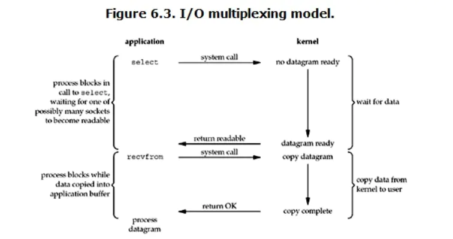

# 1. 异步 IO

## 并发并行

- **并发** 一个时间段,有几个程序在同一个`cpu`上运行,但是任意时刻只有一个程序在`cpu`上运行。即多个任务交替执行

- **并行** 任意时刻点上,有多个程序同时运行在多个`cpu 上。即多个任务同时执行

- **同步** 指代码调用 IO 操作时,必须等待 IO 操作才能完成返回的调用方式。

- **异步** 指代码调用 IO 操作时,不必等 IO 操作完成就返回的调用方式。

- **阻塞** 指调用函数时候当前线程被挂起

- **非阻塞** 指调用函数时候当前线程不会被挂起,而是立即返回

CPU 的速度远远快于磁盘、网络等 IO。在一个线程中，CPU 执行代码的速度极快，然而，一旦遇到 IO 操作，如读写文件、发送网络数据时，就需要等待 IO 操作完成，才能继续进行下一步操作。这种情况称为同步 IO。

在 IO 操作的过程中，当前线程被挂起，而其他需要 CPU 执行的代码就无法被当前线程执行了。

因为一个 IO 操作就阻塞了当前线程，导致其他代码无法执行，所以我们必须使用多线程或者多进程来并发执行代码，为多个用户服务。每个用户都会分配一个线程，如果遇到 IO 导致线程被挂起，其他用户的线程不受影响。

多线程和多进程的模型虽然解决了并发问题，但是系统不能无上限地增加线程。由于系统切换线程的开销也很大，所以，一旦线程数量过多，CPU 的时间就花在线程切换上了，真正运行代码的时间就少了，结果导致性能严重下降。

由于我们要解决的问题是 CPU 高速执行能力和 IO 设备的龟速严重不匹配，多线程和多进程只是解决这一问题的一种方法。

另一种解决 IO 问题的方法是异步 IO。当代码需要执行一个耗时的 IO 操作时，它只发出 IO 指令，并不等待 IO 结果，然后就去执行其他代码了。一段时间后，当 IO 返回结果时，再通知 CPU 进行处理。

按普通顺序写出的代码实际上是没法完成异步 IO 的：

```python
do_some_code()
f = open('/path/to/file', 'r')
r = f.read() # <== 线程停在此处等待IO操作结果
# IO操作完成后线程才能继续执行:
do_some_code(r)
```

所以，同步 IO 模型的代码是无法实现异步 IO 模型的。

异步 IO 模型需要一个消息循环，在消息循环中，主线程不断地重复“读取消息-处理消息”这一过程：

```python
loop = get_event_loop()
while True:
    event = loop.get_event()
    process_event(event)
```

消息模型其实早在应用在桌面应用程序中了。一个 GUI 程序的主线程就负责不停地读取消息并处理消息。所有的键盘、鼠标等消息都被发送到 GUI 程序的消息队列中，然后由 GUI 程序的主线程处理。

消息模型是如何解决同步 IO 必须等待 IO 操作这一问题的呢？当遇到 IO 操作时，代码只负责发出 IO 请求，不等待 IO 结果，然后直接结束本轮消息处理，进入下一轮消息处理过程。当 IO 操作完成后，将收到一条“IO 完成”的消息，处理该消息时就可以直接获取 IO 操作结果。

在“发出 IO 请求”到收到“IO 完成”的这段时间里，同步 IO 模型下，主线程只能挂起，但异步 IO 模型下，主线程并没有休息，而是在消息循环中继续处理其他消息。这样，在异步 IO 模型下，一个线程就可以同时处理多个 IO 请求，并且没有切换线程的操作。对于大多数 IO 密集型的应用程序，使用异步 IO 将大大提升系统的多任务处理能力。

## C10K 问题

C10K 是在 1999 年提出的技术挑战,如何在一颗 1GHz CPU,2G 内存,1gbps 网络环境下,让单台服务器同时为 1 万个客户端提供 FTP 服务

## Unix 下五种 I/O 模型

对于**一次 IO 访问（这回以 read 举例）**，数据会先被拷贝到操作系统内核的缓冲区中，然后才会从操作系统内核的缓冲区拷贝到应用程序的缓冲区，最后交给进程。所以说，**当一个 read 操作发生时，它会经历两个阶段：**

1. 等待数据准备 (Waiting for the data to be ready)

2. 将数据从内核拷贝到进程中 (Copying the data from the kernel to the process)

3. 阻塞式 I/O (blocking IO)
4. 非阻塞式 I/O (noblocking IO)
5. I/O 多路复用 (IO multiplexing)
6. 信号驱动式 I/O (signal driven IO)
7. 异步 I/O(POSIX 的 aio\_系列函数) (asynchronous IO)

### 阻塞式 IO


### 非阻塞式 IO


### I/O 多路复用



### 信号驱动式 I/O


### 异步 I/O


## IO 多路复用(select、poll、epoll)

select、poll、`epoll`都是 IO 多路复用的机制。I/O 多路复用就是通过一种机制,一个进程可以监视多个描述符,一旦某个描述符就绪(一般是读就绪或写就绪),能够通知程序进行相应的读写操作。

I/O 多路复用实际上就是用 select, poll, `epoll`监听多个`io`对象，当`io`对象有变化（有数据）的时候就通知用户进程。好处就是单个进程可以处理多个 socket。

#### 通过非阻塞 IO 实现`http`请求

```python
import socket
```

## 参考文档

https://blog.csdn.net/qq_34802511/article/details/81543817
