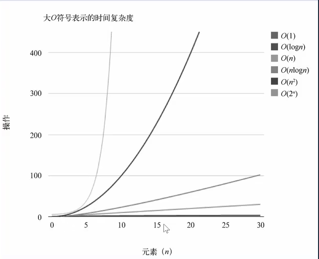

=========================
1. 算法
=========================

常见算法
========================

穷举(万能算法):求N个数的全排列,8个皇后
分而治之(减而治之): 二分查找(减而治之), 归并排序(分而治之)
贪心:最小生成数Prim，Kruskal;单源最短路Dijkstra
动态规划:背包;士兵路径

复杂度
=================

时间复杂度
空间复杂度

.. list-table:: 大O表示形式
   :widths: 15 10 40
   :header-rows: 1

   * - 符号
     - 名称
     - 算法
   * - O(1)
     - 常数的
     - 基本运算:+ , -, \*, /, % ,寻址
   * - O(logn)
     - 对数的
     - 二分查找
   * - O(n)
     - 线性的
     - 线性查找
   * - O(nlog(n))
     - 线性和对数乘积
     - 并归排序,快速排序的期望复杂度,基于比较排序的算法下界
   * - O(n²)
     - 平方
     - 朴素最近点对
   * - O(2^n)
     - 指数的
     - 枚举全部的子集
   * - O(n½)
     -
     - 枚举约数
   * - O(n³)
     -
     - Floyd最短路,普通矩阵乘法
   * - O(n!)
     -
     - 枚举全排列

|image1|

总结:
优秀O(1) < O(logn) < O(n½) < O(n) < O(nlogn)

可能可以优化 O(n²) < O(n³) < O(2n) < O(n!)

推导大O表示法的方式

- 用常量1取代运行时间中所有的加法常量
- 在修改后的运行次数函数中，只保留最高阶项
- 如果最高存在且不为1,则去除与这个项相乘的常数

