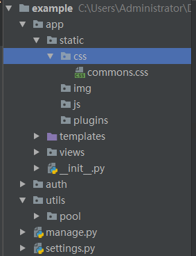

=========================
6. 模板语法
=========================

1模板的使用
------------------------
Flask使用的是Jinja2模板，Flask中模板里面，执行函数时，需要带（）才执行

1.为了防止xss攻击，加了验证，所以页面上显示字符串的形式，解决办法，有两种方法
方法一：在后端使用Markup，等价于Django里的mark_safe

::

 v = Markup("<input type='text' />")

方法二：在前端使用safe

::

 {{ v1|safe }}

2.静态文件的两种导入方式 
------------------------------------

目录结构：

方式一：

..  image:: ./image/18101704.png
    :align: center
    :alt: 方式一

方式二：

..  image:: ./image/18101705.png
    :align: center
    :alt: 方式二

3. flask中模板语法不提示，解决办法
---------------------------------------------------

..  image:: ./image/18101706.png
    :align: center
    :alt: 语法提示

点击选择jinja2

3. 自定义模板方法
------------------------------------------

Flask中自定义模板方法的方式和Bottle相似，创建一个函数并通过参数的形式传入render_template，

run.py

::

 from flask import Flask,url_for,render_template,Markup
 app = Flask(__name__)

 def test(a,b):    #自定义的标签，此方法在使用时，需要在render_temlate中传入到指定以页面使用
    return a+b

 @app.template_global()   # 不需要传入，可直接在页面使用
 def sb(a1, a2):
    return a1 + a2 + 100

 @app.template_filter()    #不需要传入，使用时要在一个值（此值作为第一个参数传入到过滤器中）的后面加入|，然后再加参数
 def db(a1, a2, a3):
    return a1 + a2 + a3

 @app.route('/index')
 def index():
    v1 = "字符串"
    v2 = [11,22,33]
    v3 = {"k1":"v3","sdf":"sdgfgf"}
    v4 = "<input type='text' />"
    v5 = Markup("<input type='text' />")
    return render_template("index.html",v1=v1,v2=v2,v3=v3,v4=v4,v5=v5,test=test)

 if __name__ == '__main__':
    app.run(debug=True)

index.html

::

 <!DOCTYPE html>
 <html lang="en">
 <head>
    <meta charset="UTF-8">
    <meta http-equiv="X-UA-Compatible" content="IE=edge">
    <meta name="viewport" content="width=device-width">
    <title>Title</title>
 </head>
 <body>
 {{ v1 }}
 <ul>
    
       <li>{{ foo }}</li>
    
    {{ v2.1 }}

    
    <li>{{ k }} {{ v }}</li>
    
    {{ v3.k1 }}
    {{ v3.get("k1") }}

    {{ v4|safe }}
    {{ v5 }}

    <h1>{{ test(1,2) }}</h1>
    
{{ sb(1,2) }}

    
{{ 1| db(2,3) }}

 </ul>
 </body>
 </html>

PS:模板继承的方法和django的一样。

4. 宏
---------------------------------------------

只有定义的东西在很多地方去使用的时候才去用它,
html

::

 
    <input type="{{ type }}" name="{{ name }}" value="{{ value }}">

　　<input type="{{ type }}" name="{{ name }}" value="{{ value }}">
　　<input type="{{ type }}" name="{{ name }}" value="{{ value }}">

 

 {{ xx('n1') }}

相当于在页面上定义了一个名为xx的'函数'，这个函数接收3个参数，我们给type和value写上了默认值，此时调用，我们还需要传入一个参数，我们此时传入了一个n1，则
页面上会生成3个input框，name都为n1