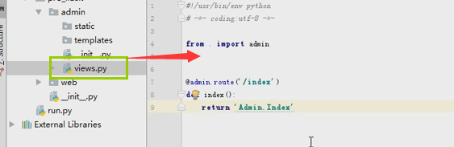

================================
8. 蓝图
================================

定义蓝图
=========

::

 from flask import Blueprint
 admin = Blueprint("admin",__name__)
 import views

注册蓝图
============

::

 from admin import admin as admin_buleprint
 app.register_blueprint(admin_buleprint,url_prefix="admin")

调用蓝图
===========

::

 from . import admin
 @admin.route("/")

如果代码非常多，要进行归类。不同的功能放在不同的文件，吧相关的视图函数也放进去。蓝图也就是对flask的目录结构进行分配（应用于小，中型的程序）

蓝图用于为应用提供目录划分：

小中型：

..image:: ./image/18101707.png
    :align: center
    :alt: 小中型

 manage.py

::
 
 import fcrm
 if __name__ == '__main__':
    fcrm.app.run()

__init__.py(只要一导入fcrm就会执行__init__.py文件)

::

 from flask import Flask
 #导入accout 和order
 from fcrm.views import accout
 from fcrm.views import order
 app = Flask(__name__)
 print(app.root_path)  #根目录

 app.register_blueprint(accout.accout)  #把蓝图注册到app里面，accout.accout是创建的蓝图对象
 app.register_blueprint(order.order)

accout.py

::

 from flask import  Blueprint,render_template
 accout = Blueprint("accout",__name__)

 @accout.route('/accout')
 def xx():
    return "accout"

 @accout.route("/login")
 def login():
    return render_template("login.html")

order.py

::

 from flask import Blueprint
 order = Blueprint("order",__name__)

 @order.route('/order')
 def register():   
    return "order

大型
---------------------------------------

..  image:: ./image/18101708.png
    :align: center
    :alt: 大型

..  image:: ./image/18101708_02.png
    :align: center
    :alt: 大型

注意：
--------------------------------

蓝图中的视图函数的名字不能和蓝图对象的名字一样！！！

其他：
-----------------------------------------

蓝图URL前缀：xxx = Blueprint('account', __name__,url_prefix='/xxx')
蓝图子域名：xxx = Blueprint('account', __name__,subdomain='admin')
# 前提需要给配置SERVER_NAME： app.config['SERVER_NAME'] = 'hc.com:5000'
# 访问时：admin.hc.com:5000/login.html
