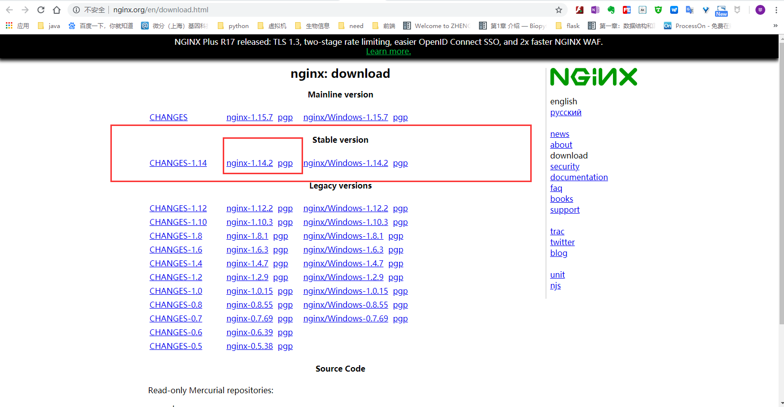

====================
14. ngix使用
====================

1. ngix 安装
---------------

访问 nginx 官网：http://nginx.org/en/download.html 选择 Stable version 

::

 wget  http://101.96.10.43/nginx.org/download/nginx-1.14.2.tar.gz

|image1|

::

 tar zxvf nginx-1.14.2.tar.gz
 cd nginx-1.14.2
 yum -y install gcc zlib zlib-devel pcre-devel openssl openssl-devel #安装依赖
 ./configure && make && make install

2. 启动nginx
-----------------

::

 whereis ngix
 nginx: /usr/local/nginx

 进入nginx 目录启动
 cd /usr/local/nginx
 启动nginx 
 /usr/local/nginx/sbin/nginx

