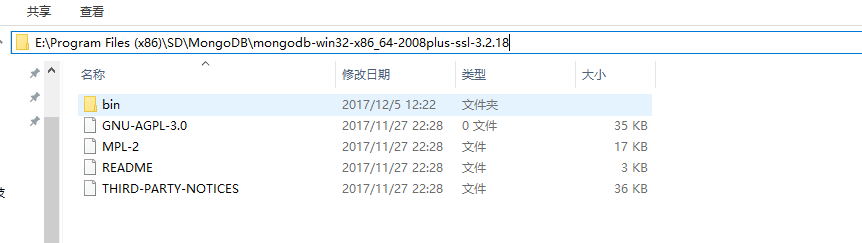

========================
mongodb安装
========================

1. mongodb下载
-----------------------------------------

1.官网下载mongoDB：http://www.mongodb.org/downloads，选择windows平台

..  image:: ./image/1.png
    :align: center
    :alt: git strucer

2.配置文件
-------------------

第一步：解压到一个盘上，例如我的解压的目录E:\Program Files (x86)\SD\MongoDB\mongodb-win32-x86_64-2008plus-ssl-3.2.18，如图所示：

第二步：配置存放日志和数据的目录，不然mongoDB启动不起来，如图所示：

我们在E:\Program Files (x86)\SD\MongoDB\mongodb-win32-x86_64-2008plus-ssl-3.2.18 目录下，创建一个mongodb.cfg 配置文件，有两个属性logpath和dbpath，分别设定值，并且在d盘创建对应配置路径的文件夹，如图所示：

dbpath=D:/\mongodb/\data/\db
logpath=D:/\mongodb/\data/\log/\mongodb.log

打开控制台cmd，进入mongodb安装目录/bin文件下运行命令：mongod.exe  --config  "E:\Program Files (x86)/\SD/\MongoDB/\mongodb-win32-x86_64-2008plus-ssl-3.2.18/\mongodb.cfg"，来启动MongoDB服务器，
--config 选项表示启动时通过E:\Program Files (x86)/\SD/\MongoDB/\mongodb-win32-x86_64-2008plus-ssl-3.2.18/\mongodb.cfg，注意这里路径一定要用“”括起来，配置文件的信息配置服务器。如图所示：

..  image:: ./image/3.png
    :align: center
    :alt: git strucer

..  image:: ./image/4.png
    :align: center
    :alt: git strucer

3. 测试
-----------------------

我们在运行cmd.exe进入dos命令界面,然后进入cd E:\Program Files (x86)/\SD/\MongoDB/\mongodb-win32-x86_64-2008plus-ssl-3.2.18/\bin目录下，运行mongo命令，
测试一下连接，如图所示：

4. 添加mongoDb到Window Service
-------------------------------------

我们当我们把运行MongoDB服务器的dos命令界面关掉，这样我们就不能链接MongoDB，然后像mysql一样添加到Windows Service，然后在命令行上启动服务和关闭服务，
这样方便我们操作和管理服务。

我们接下来需要把MongoDB到Windows Service，用到的命令是--install设定安装MongoDB为服务器到Windows Service

第一步：执行—install,

以管理员身份启动cmd, 进入dos命令界面，先进入到cd E:\Program Files (x86)\SD\MongoDB\mongodb-win32-x86_64-2008plus-ssl-3.2.18\bin目录下，执行命令：
mongod.exe  --config  "E:\Program Files (x86)\SD\MongoDB\mongodb-win32-x86_64-2008plus-ssl-3.2.18\mongodb.cfg" --install --serviceName "MongoDB"  
如图所示：

..  image:: ./image/6.png
    :align: center
    :alt: git strucer

第二步：启动/关闭MongoDB服务

net start mongodb 启动MongoDB服务
net stop mongodb 启动MongoDB服

..  image:: ./image/8.png
    :align: center
    :alt: git strucer
