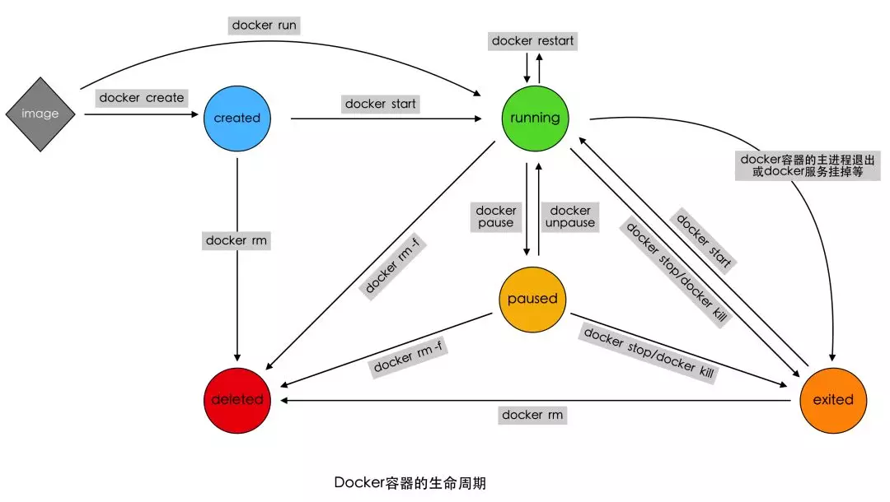

========================================
1. Docker 基本概念
========================================

基本概念
====================

Docker组成
>>>>>>>>>>>>>>>>>>>>>

Docker组成：Docker Client 和 Docker Server

Docker组件：

- 镜像（Image）
 
- 容器（Container）
 
- 仓库（Repository）

容器（Container）：容器是一种轻量级、可移植、并将应用程序进行的打包的技术，使应用程序可以在几乎任何地方以相同的方式运行，Docker将镜像文件运行起来后，产生的对象就是容器。容器相当于是镜像运行起来的一个实例且容器具备一定的生命周期。

Docker容器和虚拟机的区别
>>>>>>>>>>>>>>>>>>>>>>>>>>>>>>

相同点：

- 容器和虚拟机一样，都会对物理硬件资源进行共享使用。
- 容器和虚拟机的生命周期比较相似（创建、运行、暂停、关闭等等）。
- 容器中或虚拟机中都可以安装各种应用，如redis、mysql、nginx等。也就是说，在容器中的操作，如同在一个虚拟机(操作系统)中操作一样。
- 同虚拟机一样，容器创建后，会存储在宿主机上：linux上位于/var/lib/docker/containers下

不同点：

- 虚拟机的创建、启动和关闭都是基于一个完整的操作系统。一个虚拟机就是一个完整的操作系统。而容器直接运行在宿主机的内核上，其本质上以一系列进程的结合。
- 容器是轻量级的，虚拟机是重量级的。首先容器不需要额外的资源来管理(不需要Hypervisor、Guest OS)，虚拟机额外更多的性能消耗；其次创建、启动或关闭容器，如同创建、启动或者关闭进程那么轻松，而创建、启动、关闭一个操作系统就没那么方便了。

也因此，意味着在给定的硬件上能运行更多数量的容器，甚至可以直接把Docker运行在虚拟机上。

容器的生命周期管理
>>>>>>>>>>>>>>>>>>>>>>>

|image1|

Docker内部组件
>>>>>>>>>>>>>>>>>>>>>>

1. Namespaces 命名空间，Linux内核提供的一种对进程 **资源隔离** 的机制，例如进程，网络，挂载点等资源。
2. CGroups 控制组，Linux内核提供的一种 **限制进程资源** 的机制；例如cpu,内存等资源。 ls -l /sys/fs/cgroups   主要防止某一个容器资源过多导致宿主机资源紧张
3. UnionFS 联合文件系统，支持将不同位置的目录挂载到同一虚拟文件系统，形成一种分层的模型。  

使用场景
>>>>>>>>>>>>>>>>>>>>>>>>>

1. Simplifying Configuration(简化配置)
#. Developer Productivity(简化开发环境)
#. Server Consolidation(应用隔离)
#. Multi-tenancy(多用户)
#. Code Pipeline Management(快速部署)
#. App Isolation(应用隔离)
#. Debugging Capabilities(开发调试)
#. Repid Deployment(交付方式改变)
#. 持续集成：CI(持续集成)、CD(持续部署) ;自动化项目测试流程:构建、部署、部署、测试、发布

Docker安装与启动
======================

1. 安装Docker
>>>>>>>>>>>>>>>>>>>

1) yum包更新到最新

.. code-block:: shell

   sudo yum update 

2）安装需要的软件包， yum-util 提供yum-config-manager功能，另外两个是devicemapper驱动依赖的

.. code-block:: shell

   sudo yum install -y yum-utils device-mapper-persistent-data lvm2
   
   
3）设置yum源为阿里云
   
.. code-block:: shell

   sudo yum-config-manager --add-repo http://mirrors.aliyun.com/docker-ce/linux/centos/docker-ce.repo
   
   
4）安装docker
   
.. code-block:: shell

   sudo yum install docker-ce
   
5）安装后查看docker版本
   
.. code-block:: shell

   docker -v
   docker version # 查看Docker版本
   
   
2. 设置ustc的镜像
>>>>>>>>>>>>>>>>>>> 

ustc是老牌的linux镜像服务提供者了，还在遥远的ubuntu 5.04版本的时候就在用。ustc的docker镜像加速器速度很快。ustc docker mirror的优势之一就是不需要注册，是真正的公共服务。

`https://lug.ustc.edu.cn/wiki/mirrors/help/docker <https://lug.ustc.edu.cn/wiki/mirrors/help/docker>`_

编辑该文件：

.. code-block:: shell

   vi /etc/docker/daemon.json  

在该文件中输入如下内容：

.. code-block:: json

   {
   "registry-mirrors": ["https://docker.mirrors.ustc.edu.cn"]
   }

3. Docker的启动与停止
>>>>>>>>>>>>>>>>>>>>>>>>>

**systemctl** 命令是系统服务管理器指令
   
启动docker：
   
.. code-block:: shell

   systemctl start docker
   
   
停止docker：
   
.. code-block:: shell

   systemctl stop docker
   
   
重启docker：
   
.. code-block:: shell

   systemctl restart docker
   
   
查看docker状态：
   
.. code-block:: shell

   systemctl status docker
   
   
开机启动：
   
.. code-block:: shell

   systemctl enable docker
   
   
查看docker概要信息
   
.. code-block:: shell

   docker info
   
   
查看docker帮助文档

.. code-block:: shell

   docker --help

Docker常用命令
===================

1. 镜像相关命令
>>>>>>>>>>>>>>>>>>>>

.. code-block:: shell

   docker search centos #查看搜索镜像

   docker pull centos:latest # 下载镜像

   docker images # 查看当前系统中的images信息

1. 查看docker容器中运行的容器
::::::::::::::::::::::::::::::::

.. code-block:: shell

   docker ps  # 查看docker容器中运行的容器
   docker ps -a # 查看所有容器
   docker ps -l # 查看最后一次运行的容器
   docker ps -f status=exited # 查看停止的容器

2. 容器相关命令
>>>>>>>>>>>>>>>>>>>>>>>>>

容器创建(docker create)
:::::::::::::::::::::::::::::::

命令格式：
docker run [参数] 镜像 [容器执行命令] [执行命令提供的参数]

.. code-block:: shell

   docker run -itd --name=容器名称 镜像名称:标签 /bin/bash

常用参数：

- -t 分配一个虚拟终端

- -i 保持输入打开

- -d 守护式容器在后台运行，并打印容器id

- --name 为创建的容器命令

- -rm 容器结束后自动删除容器

推荐使用 docker run -dti 来启动所需容器。

登录守护式容器方式

.. code-block:: shell

   docker exec -it 容器名称/容器ID /bin/bash

停止与启动容器
::::::::::::::::::::

.. code-block:: shell

   docker stop 容器名称/容器ID   # 停止容器
   docker start 容器名称/容器ID  # 启动容器

文件拷贝
::::::::::::::

.. code-block:: shell 

   docker cp 需要拷贝的文件或目录  容器名称:容器目录   # 将文件拷贝到容器
   docker cp 容器名称:容器目录   需要拷贝的文件或目录  # 将文件从容器拷贝出来

目录挂载
::::::::::::::

创建容器 -v **宿主目录:容器目录**

.. code-block:: shell

   docker run -id -v /usr/local/myhtml:/usr/local/myhtml --name=mycentos7 centos:7

如果共享的是多级目录,可能出现权限不足提示

这是因为Centos7中的安全模块selinux把权限禁用了, 添加参数 **--privileged=true** 来解决挂载的目录没有权限的问题

查看容器IP地址
::::::::::::::::::::

.. code-block:: shell

   docker inspect 容器名称/容器ID

   # 可以直接执行下面的命令直接输出IP地址
   docker inspect --format='{{.NetworkSettings.IPAddress}}' 容器名称/容器ID

应用部署
================

1、MySQL部署
>>>>>>>>>>>>>>>>

1. 拉取mysql镜像
::::::::::::::::::::

.. code-block:: shell

   docker pull centos/mysql-57-centos7

2. 创建容器 
:::::::::::::::

.. code-block:: shell

   # -p 表示端口映射,格式为宿主机映射端口:容器运行端口
   # -e 表示添加环境变量 MYSQL_ROOT_PASSWORD 是root用户的登录密码
   docker run -di --name=tensquare_mysql -p 3306:3306 -e MYSQL_ROOT_PASSWORD=123456 mysql 

2、tomcat部署
>>>>>>>>>>>>>>>>>>

1. 拉取tomcat镜像
::::::::::::::::::::

.. code-block:: shell

   docker pull tomcat:7-jre7

2. 创建容器 
::::::::::::::::::

.. code-block:: shell

   docker run -di --name=mytomcat -p 9000:8080 \
   -v /usr/local/webapps:/usr/local/tomcat/webapps tomcat:7-jre7

3、Redis部署
>>>>>>>>>>>>>>>>>>>

1. 拉取Redis镜像
::::::::::::::::::::

.. code-block:: shell

   docker pull redis

2. 创建容器 
:::::::::::::::

.. code-block:: shell

   docker run -di --name=myredis -p 6379:6379 redis

4、Nginx部署
>>>>>>>>>>>>>>>>>>>>>

1. 拉取nginx镜像
::::::::::::::::::::

.. code-block:: shell

   docker pull nginx

2. 创建容器 
:::::::::::::::

.. code-block:: shell 

   docker run -di --name=mynginx -p 80:80 nginx

迁移与备份
=====================

.. code-block:: shell

   # 容器保存为镜像
   docker commit mynginx mynginx_i 

   # 镜像备份
   docker save -o mynginx.tar mynginx_i

   # 镜像恢复与迁移
   
   docker load -i mynginx.tar

::

 docker run -it centos:latest  #运行docker容器

 winpty docker run -it zhengpanone/centos-python  # **在windows下使用git bash 使用**

 docker commit -m '' CONTAINER ID IMAGE  # 将容器转化为一个镜像

 docker commit -m "安装 net-tools" -a 'zhengpanone'  5301d7c9bc21 zhengpanone/centos-python:V1
 # -m 指定说明信息; 
 # -a 指定用户信息 ;5301d7c9bc21代表容器id; 
 zhengpanone/centos-python:V1指定目标镜像的用户名、仓库名和tag信息

 docker rmi -f d0049ff7d6d7 #删除docker容器 docker rmi image_name/image_id

 docker rm container_name/container_id # 删除docker容器

 docker save -o ./centos.tar zhengpanone/centos:git # 保存镜像 -o/--output

 docker load -i ./centos.tar # 加载镜像 -i/--input 

利用Dockerfile创建镜像
Dockerfile可以理解为一种配置文件,用来告诉docker build命令应该执行那些操作。
一个简易的Dockerfile文件如下所示

::

 # 说明该镜像以那个镜像为基础
 FROM centos:latest 

 # 构建者的基本信息
 MAINTAINER zhengpanone 

 # 在build 这个镜像时执行的操作
 RUN yum update
 RUN yum install -y git

有了Dockerfile 利用build命令构建镜像

::
 
 docker build -f ./Dockerfile  -t "zhengpanone/centos-git:gitdir" .

Docker 基础命令
======================================

.. code::

 
 Usage:
 docker [OPTIONS] COMMAND [arg...]
       docker daemon [ --help | ... ]
       docker [ --help | -v | --version ]
 

 Options:
  --config=~/.docker              Location of client config files  #客户端配置文件的位置
  -D, --debug=false               Enable debug mode  #启用Debug调试模式
  -H, --host=[]                   Daemon socket(s) to connect to  #守护进程的套接字（Socket）连接
  -h, --help=false                Print usage  #打印使用
  -l, --log-level=info            Set the logging level  #设置日志级别
  --tls=false                     Use TLS; implied by--tlsverify  #
  --tlscacert=~/.docker/ca.pem    Trust certs signed only by this CA  #信任证书签名CA
  --tlscert=~/.docker/cert.pem    Path to TLS certificate file  #TLS证书文件路径
  --tlskey=~/.docker/key.pem      Path to TLS key file  #TLS密钥文件路径
  --tlsverify=false               Use TLS and verify the remote  #使用TLS验证远程
  -v, --version=false             Print version information and quit  #打印版本信息并退出

 Commands:
    attach    Attach to a running container  #当前shell下attach连接指定运行镜像
    build     Build an image from a Dockerfile  #通过Dockerfile定制镜像
    commit    Create a new image from a container's changes  #提交当前容器为新的镜像
    cp    Copy files/folders from a container to a HOSTDIR or to STDOUT  #从容器中拷贝指定文件或者目录到宿主机中
    create    Create a new container  #创建一个新的容器，同run 但不启动容器
    diff    Inspect changes on a container's filesystem  #查看docker容器变化
    events    Get real time events from the server#从docker服务获取容器实时事件
    exec    Run a command in a running container#在已存在的容器上运行命令
    export    Export a container's filesystem as a tar archive  #导出容器的内容流作为一个tar归档文件(对应import)
    history    Show the history of an image  #展示一个镜像形成历史
    images    List images  #列出系统当前镜像
    import    Import the contents from a tarball to create a filesystem image  #从tar包中的内容创建一个新的文件系统映像(对应export)
    info    Display system-wide information  #显示系统相关信息
    inspect    Return low-level information on a container or image  #查看容器详细信息
    kill    Kill a running container  #kill指定docker容器 
    load    Load an image from a tar archive or STDIN  #从一个tar包中加载一个镜像(对应save)
    login    Register or log in to a Docker registry#注册或者登陆一个docker源服务器
    logout    Log out from a Docker registry  #从当前Docker registry退出
    logs    Fetch the logs of a container  #输出当前容器日志信息
    pause    Pause all processes within a container#暂停容器
    port    List port mappings or a specific mapping for the CONTAINER  #查看映射端口对应的容器内部源端口
    ps    List containers  #列出容器列表
    pull    Pull an image or a repository from a registry  #从docker镜像源服务器拉取指定镜像或者库镜像
    push    Push an image or a repository to a registry  #推送指定镜像或者库镜像至docker源服务器
    rename    Rename a container  #重命名容器
    restart    Restart a running container  #重启运行的容器
    rm    Remove one or more containers  #移除一个或者多个容器
    rmi    Remove one or more images  #移除一个或多个镜像(无容器使用该镜像才可以删除，否则需要删除相关容器才可以继续或者-f强制删除)
    run    Run a command in a new container  #创建一个新的容器并运行一个命令
    save    Save an image(s) to a tar archive#保存一个镜像为一个tar包(对应load)
    search    Search the Docker Hub for images  #在docker
 hub中搜索镜像
    start    Start one or more stopped containers#启动容器
    stats    Display a live stream of container(s) resource usage statistics  #统计容器使用资源
    stop    Stop a running container  #停止容器
    tag         Tag an image into a repository  #给源中镜像打标签
    top       Display the running processes of a container #查看容器中运行的进程信息
    unpause    Unpause all processes within a container  #取消暂停容器
    version    Show the Docker version information#查看容器版本号
    wait         Block until a container stops, then print its exit code  #截取容器停止时的退出状态值

 Run 'docker COMMAND --help' for more information on a command.  #运行docker命令在帮助可以获取更多信息
 docker search  hello-docker  # 搜索hello-docker的镜像
 docker search centos # 搜索centos镜像
 docker pull hello-docker # 获取centos镜像
 docker run  hello-world   #运行一个docker镜像，产生一个容器实例（也可以通过镜像id前三位运行）
 docker image ls  # 查看本地所有镜像
 docker images  # 查看docker镜像
 docker image rmi hello-docker # 删除centos镜像
 docker ps  #列出正在运行的容器（如果创建容器中没有进程正在运行，容器就会立即停止）
 docker ps -a  # 列出所有运行过的容器记录
 docker save centos > /opt/centos.tar.gz  # 导出docker镜像至本地
 docker load < /opt/centos.tar.gz   #导入本地镜像到docker镜像库
 docker stop  `docker ps -aq`  # 停止所有正在运行的容器
 docker  rm `docker ps -aq`    # 一次性删除所有容器记录
 docker rmi  `docker images -aq`   # 一次性删除所有本地的镜像记录

https://www.cnblogs.com/521football/p/10483980.html