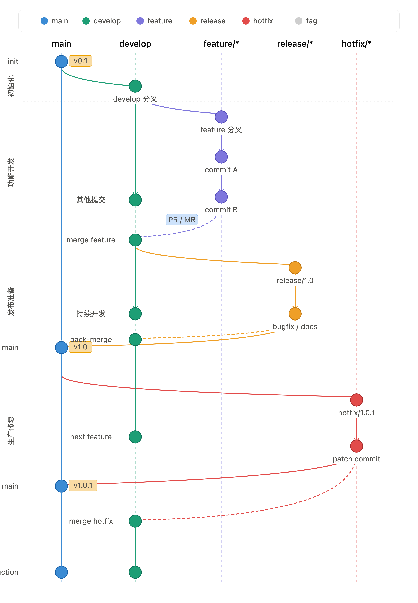

=========================
企业 Git 分支管理
=========================

.. contents:: 目录
   :depth: 3
   :local:
   :backlinks: none

Git Flow 规范文档
============================

Git Flow 是由 Vincent Driessen 于 2010 年提出的分支管理策略，已成为企业级软件团队的行业标准。本文档在原版基础上针对现代 DevOps 实践进行了扩展，适用于中大规模团队的持续交付场景。

概述与设计目标
----------------------

核心设计目标
^^^^^^^^^^^^^^^^^^^^^^

- **并行开发**：多功能同步推进，互不干扰
- **发布管理**：通过独立分支隔离发布准备与日常开发
- **生产稳定**：main 永远处于可发布状态
- **紧急响应**：热修复通道绕过正常开发周期
- **审计追踪**：完整的提交历史与版本标签

适用场景
^^^^^^^^^^^^^^^^^^^^^^

.. list-table::
   :header-rows: 1
   :widths: 60 40

   * - 场景
     - 推荐程度
   * - 有计划发布周期的产品
     - ✅ 强烈推荐
   * - 多版本并行维护
     - ✅ 强烈推荐
   * - 10 人以上研发团队
     - ✅ 推荐
   * - 开源项目（频繁外部 PR）
     - ✅ 推荐
   * - 小型团队 / 持续部署 SaaS
     - ⚠️ 可考虑 GitHub Flow
   * - 单人项目
     - ❌ 过度设计

----

|image1|

分支结构详解
--------------------

main — 生产主干
^^^^^^^^^^^^^^^^^^^^^^

.. note::

   **main 分支规则**

   - 始终指向最新生产环境代码
   - 只接受来自 ``release/*`` 或 ``hotfix/*`` 的合并
   - 每次合并必须打语义化版本标签(``v1.0``、 ``v1.0.1``……）
   - 启用分支保护，禁止直接 push 和 force push
   - 要求至少 2 名 Reviewer 审批

develop — 集成分支
^^^^^^^^^^^^^^^^^^^^^^

.. note::

   **develop 分支规则**

   - 汇聚所有已完成 ``feature`` 的集成点
   - CI 流水线持续运行（单测 + 集成测试）
   - 禁止直接 push，所有变更通过 PR 进入
   - 每日自动部署至 ``staging`` 环境
   - 是 ``feature/*`` 和 ``release/*`` 的分叉来源

feature/\* — 功能分支
^^^^^^^^^^^^^^^^^^^^^^^^^^^^

**命名规范**：

.. code-block:: text

   feature/<issue-id>-<short-description>

   示例：
     feature/PROJ-123-user-oauth
     feature/PROJ-456-payment-integration
     feature/PROJ-789-dark-mode

.. note::

   **feature 分支规则**

   - 从 ``develop`` 创建，合并回 ``develop``
   - 生命周期：需求开发期间（通常 1–2 Sprint）
   - 合并方式： **Squash Merge** （保持 develop 历史整洁）
   - 合并前必须 rebase 最新 develop 解决冲突
   - 合并后立即删除
   - 建议单分支对应单个 Jira/Linear Issue

release/\* — 发布分支
^^^^^^^^^^^^^^^^^^^^^^^^^^^^

**命名规范**：

.. code-block:: text

   release/<major>.<minor>

   示例：
     release/1.0
     release/1.1
     release/2.0

.. note::

   **release 分支规则**

   - 从 ``develop`` 创建，双向合并至 ``main`` 和 ``develop``
   - 创建时机：当 develop 积累了足够功能，准备发布
   - 只允许：bugfix、文档更新、版本号变更
   - 严禁合入新功能（新功能等待下个 release）
   - 合并至 main 后打版本标签
   - 立即 back-merge 回 develop，防止修复丢失

hotfix/\* — 紧急修复分支
^^^^^^^^^^^^^^^^^^^^^^^^^^^^

**命名规范**：

.. code-block:: text

   hotfix/<major>.<minor>.<patch>

   示例：
     hotfix/1.0.1
     hotfix/1.0.2
     hotfix/2.1.1

.. note::

   **hotfix 分支规则**

   - 从 ``main`` （生产标签）创建，双向合并至 ``main`` 和 ``develop``
   - 仅用于修复生产环境紧急缺陷（P0/P1 级别）
   - 必须在 develop 同步 back-merge，防止回归
   - patch 版本号 +1，打新标签后删除分支
   - 修复范围最小化，禁止顺带重构或新增功能

----

完整工作流程
-----------------

功能开发流程
^^^^^^^^^^^^^^^^^^^^^^^^^^^^

1. **从 develop 创建 feature 分支**

   .. code-block:: bash

      git checkout develop
      git pull origin develop
      git checkout -b feature/PROJ-123-user-oauth

2. **日常开发提交（遵循 Conventional Commits）**

   .. code-block:: bash

      git add .
      git commit -m "feat(auth): add OAuth2 provider selection"
      git commit -m "test(auth): add unit tests for token refresh"
      git commit -m "docs(auth): update API documentation"

3. **定期同步 develop 最新变更**

   .. code-block:: bash

      git fetch origin
      git rebase origin/develop
      # 解决冲突后
      git rebase --continue

4. **推送并创建 Pull Request**

   .. code-block:: bash

      git push origin feature/PROJ-123-user-oauth
      # 在 GitHub/GitLab 界面创建 PR，目标分支：develop

5. **PR 审核通过后 Squash Merge 并删除分支**

   .. code-block:: bash

      # 合并后在远端删除
      git push origin --delete feature/PROJ-123-user-oauth
      # 本地清理
      git branch -d feature/PROJ-123-user-oauth

版本发布流程
^^^^^^^^^^^^^^^^^^^^^^^^^^^^

1. **从 develop 创建 release 分支**

   .. code-block:: bash

      git checkout develop
      git pull origin develop
      git checkout -b release/1.1

2. **稳定化工作（仅 bugfix + 文档 + 版本号）**

   .. code-block:: bash

      # 更新版本文件
      echo "1.1.0" > VERSION
      npm version 1.1.0 --no-git-tag-version

      git commit -m "chore(release): bump version to 1.1.0"
      git commit -m "fix(payment): resolve edge case in refund flow"

3. **合并至 main 并打标签**

   .. code-block:: bash

      git checkout main
      git pull origin main
      git merge --no-ff release/1.1 -m "chore(release): merge release/1.1 into main"
      git tag -a v1.1.0 -m "Release v1.1.0 - Payment & OAuth features"
      git push origin main --tags

4. **Back-merge 回 develop（关键步骤！）**

   .. code-block:: bash

      git checkout develop
      git merge --no-ff release/1.1 -m "chore(release): back-merge release/1.1 into develop"
      git push origin develop

      # 删除 release 分支
      git push origin --delete release/1.1
      git branch -d release/1.1

紧急热修复流程
^^^^^^^^^^^^^^^^^^^^^^^^^^^^

1. **从生产标签创建 hotfix 分支**

   .. code-block:: bash

      # 从出问题的版本标签创建，而非 main 最新提交
      git checkout -b hotfix/1.1.1 v1.1.0

2. **修复并提交**

   .. code-block:: bash

      git commit -m "fix(auth): prevent token reuse after logout"
      # 更新 patch 版本号
      echo "1.1.1" > VERSION
      git commit -m "chore(release): bump version to 1.1.1"

3. **合并至 main 并打标签**

   .. code-block:: bash

      git checkout main
      git merge --no-ff hotfix/1.1.1 -m "fix: merge hotfix/1.1.1 into main"
      git tag -a v1.1.1 -m "Hotfix v1.1.1 - Security patch"
      git push origin main --tags

4. **同步至 develop（防止回归！）**

   .. code-block:: bash

      # 若当前存在 release 分支，应合并至 release 而非 develop
      git checkout develop
      git merge --no-ff hotfix/1.1.1 -m "fix: back-merge hotfix/1.1.1 into develop"
      git push origin develop

      git push origin --delete hotfix/1.1.1
      git branch -d hotfix/1.1.1

----

提交规范（Conventional Commits）
----------------------------------------

所有提交信息必须遵循 Conventional Commits 规范，以支持自动化 CHANGELOG 生成和语义化版本推断。

格式规范
^^^^^^^^^^^^^^^^^^^^^^^^^^^^

.. code-block:: text

   <type>(<scope>): <subject>

   [optional body]

   [optional footer(s)]

类型说明
^^^^^^^^^^^^^^^^^^^^^^^^^^^^

.. list-table::
   :header-rows: 1
   :widths: 20 20 60

   * - 类型
     - 触发版本
     - 说明
   * - ``feat``
     - minor +1
     - 新功能
   * - ``fix``
     - patch +1
     - 缺陷修复
   * - ``BREAKING CHANGE``
     - major +1
     - 破坏性变更（页脚标注）
   * - ``docs``
     - 无
     - 仅文档变更
   * - ``style``
     - 无
     - 代码格式（不影响逻辑）
   * - ``refactor``
     - 无
     - 重构（既非 feat 也非 fix）
   * - ``test``
     - 无
     - 添加或修正测试
   * - ``chore``
     - 无
     - 构建过程或辅助工具变更
   * - ``perf``
     - patch +1
     - 性能优化
   * - ``ci``
     - 无
     - CI/CD 配置变更
   * - ``revert``
     - 视内容
     - 回退某次提交

提交示例
^^^^^^^^^^^^^^^^^^^^^^^^^^^^

.. code-block:: text

   # 普通功能
   feat(user): add avatar upload with size validation

   # 修复缺陷
   fix(cart): correct tax calculation for international orders

   # 破坏性变更（API 不兼容）
   feat(api)!: change authentication endpoint from /login to /auth/token

   BREAKING CHANGE: The /login endpoint has been removed.
   All clients must update to /auth/token with the new request schema.

   # 带 Issue 引用的修复
   fix(payment): prevent double charge on network timeout

   Resolves: PROJ-789
   Tested on: Safari/Chrome/Firefox

----

语义化版本管理
------------------------

版本号规则
^^^^^^^^^^^^^^^^^^^^^^^^^^^^

.. code-block:: text

   MAJOR.MINOR.PATCH[-PRERELEASE][+BUILD]

   示例：
     1.2.3
     2.0.0-beta.1
     1.5.0-rc.2
     1.2.3+20250101.sha.abc123

.. list-table::
   :header-rows: 1
   :widths: 20 40 40

   * - 版本段
     - 触发条件
     - 示例
   * - MAJOR
     - 破坏性 API 变更
     - 1.x.x → 2.0.0
   * - MINOR
     - 新功能（向后兼容）
     - 1.2.x → 1.3.0
   * - PATCH
     - 缺陷修复（向后兼容）
     - 1.2.3 → 1.2.4
   * - PRERELEASE
     - alpha/beta/rc 预发布
     - 1.3.0-rc.1

Git 标签规范
^^^^^^^^^^^^^^^^^^^^^^^^^^^^

.. code-block:: bash

   # 创建带注释的标签（必须带注释，禁止轻量标签）
   git tag -a v1.2.3 -m "Release v1.2.3"

   # 推送标签
   git push origin v1.2.3

   # 推送所有本地标签（慎用）
   git push origin --tags

   # 列出标签
   git tag -l "v1.*"

----

CI/CD 集成设计
-------------------

分支与环境映射
^^^^^^^^^^^^^^^^^^^^^^^^^^^^

.. list-table::
   :header-rows: 1
   :widths: 20 20 25 35

   * - 分支
     - 触发条件
     - 部署环境
     - 测试范围
   * - ``feature/*``
     - push / PR
     - preview env
     - 单测 + Lint
   * - ``develop``
     - merge / push
     - staging
     - 全量自动化测试
   * - ``release/*``
     - push
     - UAT
     - 回归测试 + E2E
   * - ``main``
     - merge
     - production
     - 冒烟测试
   * - ``hotfix/*``
     - push
     - hotfix staging
     - 定向回归测试

PR 合并质量门控
^^^^^^^^^^^^^^^^^^^^^^^^^^^^

以下所有检查必须通过，PR 方可合并：

- ✅ 单元测试覆盖率 ≥ 80%
- ✅ Lint 检查（ESLint / Pylint / golangci-lint）零错误
- ✅ SAST 静态安全扫描（SonarQube / Semgrep）无高危
- ✅ 依赖漏洞扫描（Snyk / Dependabot）无高危
- ✅ 构建成功（Docker image 可正常 build）
- ✅ 至少 2 名核心成员 Code Review 通过
- ✅ 所有 Review 意见已处理（Resolved）
- ✅ 无 WIP / Draft 标记

GitHub Actions 示例配置
^^^^^^^^^^^^^^^^^^^^^^^^^^^^

.. code-block:: yaml

   name: CI Pipeline

   on:
     push:
       branches: [develop, "release/*", "hotfix/*"]
     pull_request:
       branches: [develop, main]

   jobs:
     test:
       runs-on: ubuntu-latest
       steps:
         - uses: actions/checkout@v4
         - name: Install dependencies
           run: npm ci
         - name: Run tests
           run: npm run test:coverage
         - name: Upload coverage
           uses: codecov/codecov-action@v4

     lint:
       runs-on: ubuntu-latest
       steps:
         - uses: actions/checkout@v4
         - run: npm run lint

     security:
       runs-on: ubuntu-latest
       steps:
         - uses: actions/checkout@v4
         - uses: snyk/actions/node@master
           env:
             SNYK_TOKEN: ${{ secrets.SNYK_TOKEN }}

----

分支保护规则配置
-----------------------

main 分支保护
^^^^^^^^^^^^^^^^^^^^^^^^^^^^

- Require a pull request before merging

  - Required approvals: 2
  - Dismiss stale pull request approvals when new commits are pushed
  - Require review from Code Owners

- Require status checks to pass before merging

  - Require branches to be up to date before merging
  - Status checks: ``CI / test``, ``CI / lint``, ``CI / security``

- Do not allow bypassing the above settings
- Restrict who can push to matching branches（仅 Release Manager 角色）
- Allow force pushes: **禁用**
- Allow deletions: **禁用**

develop 分支保护
^^^^^^^^^^^^^^^^^^^^^^^^^^^^

- Require a pull request before merging

  - Required approvals: 1
  - Require status checks: ``CI / test``, ``CI / lint``

- Do not allow bypassing the above settings
- Allow force pushes: **禁用**
- Require linear history（可选，结合 Squash Merge 使用）

CODEOWNERS 配置示例
^^^^^^^^^^^^^^^^^^^^^^^^^^^^

.. code-block:: text

   # .github/CODEOWNERS

   # 默认所有文件需要核心团队审批
   * @org/core-team

   # 安全相关代码需要安全团队审批
   /src/auth/       @org/security-team @org/core-team
   /src/payment/    @org/security-team @org/core-team

   # 基础设施配置需要 DevOps 团队审批
   /.github/        @org/devops-team
   /Dockerfile*     @org/devops-team
   /k8s/            @org/devops-team

   # 数据库迁移需要 DBA 审批
   /migrations/     @org/dba-team @org/core-team

----

常见问题与解决方案
-----------------------

合并冲突处理
^^^^^^^^^^^^^^^^^^^^^^^^^^^^

.. code-block:: bash

   # 场景：feature 分支与 develop 产生冲突

   # 1. 更新本地 develop
   git fetch origin
   git checkout develop
   git pull origin develop

   # 2. 切回 feature 分支，执行 rebase
   git checkout feature/PROJ-123-user-oauth
   git rebase origin/develop

   # 3. 解决冲突（编辑冲突文件后）
   git add <conflicted-files>
   git rebase --continue

   # 4. 若需要中止 rebase
   git rebase --abort

   # 5. 强制推送（feature 分支允许）
   git push origin feature/PROJ-123-user-oauth --force-with-lease

误操作恢复
^^^^^^^^^^^^^^^^^^^^^^^^^^^^

.. code-block:: bash

   # 场景 1：误删本地分支
   git reflog                           # 找到最后一次提交 hash
   git checkout -b feature/recover <hash>

   # 场景 2：误合并了错误的分支
   git revert -m 1 <merge-commit-hash>  # 生成反向提交，保留历史

   # 场景 3：提交了密钥或敏感信息
   git filter-repo --path secrets.txt --invert-paths
   # 同时必须在密钥提供方立即吊销并重新生成密钥！

   # 场景 4：找回刚删除的 stash
   git fsck --no-reflog | grep commit   # 找到孤立提交
   git stash apply <commit-hash>

Release 分支存在时的 hotfix 处理
^^^^^^^^^^^^^^^^^^^^^^^^^^^^^^^^^^^^^^

若在 ``release/1.1`` 分支已创建但未合并时，生产版本 v1.0.x 出现紧急 bug：

1. 从 v1.0.x 标签创建 hotfix 分支
2. 修复后合并至 main，打 v1.0.(x+1) 标签
3. 将 hotfix 合并至 ``release/1.1`` （而非 develop！）
4. ``release/1.1`` 最终合并时，bugfix 会随之带入 develop

----

团队角色与权限矩阵
--------------------------

.. list-table::
   :header-rows: 1
   :widths: 34 11 11 14 11 10 9

   * - 操作权限
     - Developer
     - Tech Lead
     - Release Mgr
     - DevOps
     - QA
     - Bot
   * - 创建 ``feature/*``
     - ✅
     - ✅
     - ✅
     - ✅
     - ❌
     - ❌
   * - 推送 ``feature/*``
     - ✅
     - ✅
     - ✅
     - ✅
     - ❌
     - ❌
   * - 创建 PR to develop
     - ✅
     - ✅
     - ✅
     - ✅
     - ❌
     - ✅
   * - Approve PR（develop）
     - ❌
     - ✅
     - ✅
     - ✅
     - ❌
     - ❌
   * - 创建 ``release/*``
     - ❌
     - ✅
     - ✅
     - ❌
     - ❌
     - ❌
   * - 合并 release → main
     - ❌
     - ❌
     - ✅
     - ❌
     - ❌
     - ❌
   * - 打 Tag
     - ❌
     - ❌
     - ✅
     - ❌
     - ❌
     - ✅
   * - 创建 ``hotfix/*``
     - ❌
     - ✅
     - ✅
     - ✅
     - ❌
     - ❌
   * - 直接 push main
     - ❌
     - ❌
     - ❌
     - ❌
     - ❌
     - ❌
   * - 配置分支保护
     - ❌
     - ❌
     - ❌
     - ✅
     - ❌
     - ❌

----

日常操作检查清单
--------------------------

Feature 开发检查清单
^^^^^^^^^^^^^^^^^^^^^^^^^^^^

- ☐ 分支名符合命名规范（含 Issue ID）
- ☐ 从最新 develop 分叉
- ☐ 提交信息遵循 Conventional Commits
- ☐ 代码已自测（本地单测全绿）
- ☐ PR 描述清晰（背景 / 变更 / 测试方法）
- ☐ PR 关联了对应的 Issue / 需求卡
- ☐ CI 全部检查通过
- ☐ 已处理所有 Review 意见
- ☐ 合并后删除 feature 分支

Release 检查清单
^^^^^^^^^^^^^^^^^^^^^^^^^^^^

- ☐ develop 上所有计划功能已合并
- ☐ staging 环境全量测试通过
- ☐ CHANGELOG.md 已更新
- ☐ 版本号已在所有相关文件中更新
- ☐ UAT 环境验收通过
- ☐ 回滚预案已准备
- ☐ 合并至 main 后立即打标签
- ☐ Back-merge 至 develop 已完成
- ☐ 通知相关团队发布完成

Hotfix 检查清单
^^^^^^^^^^^^^^^^^^^^^^^^^^^^

- ☐ 根因已明确，不是猜测
- ☐ 修复范围最小化
- ☐ 定向回归测试通过
- ☐ 从正确的版本标签分叉（非 main HEAD）
- ☐ Patch 版本号已更新
- ☐ 合并至 main 并打标签
- ☐ Back-merge 至 develop（或当前 release 分支）已完成
- ☐ 监控告警已恢复正常

GitHub Flow 规范文档
============================

概述
-----

GitHub Flow 是一种轻量级的 Git 分支管理模型，适用于持续集成（CI）和持续部署（CD）的开发模式。

GitHub Flow 的核心思想如下：

* 主分支（``main``）始终保持可发布状态。
* 所有开发工作均在独立分支进行。
* 通过 Pull Request（PR）进行代码评审。
* 合并后自动执行构建、测试和部署。

工作流程
--------

整体流程如下

.. code-block:: text

    main
      │
      ├── feature/login
      │        │
      │        └── Pull Request
      │               │
      │          Code Review
      │               │
      │            Merge
      │               │
      └──────────────► main

开发流程
--------

更新主分支
^^^^^^^^^^

开发前同步最新代码。

.. code-block:: bash

    git checkout main
    git pull origin main

创建功能分支
^^^^^^^^^^^^

所有开发均从 ``main`` 创建新的分支。

.. code-block:: bash

    git checkout -b feature/user-login

推荐命名规范：

==================== ===================================
类型                 示例
==================== ===================================
功能开发             feature/user-login
Bug 修复             bugfix/login-error
紧急修复             hotfix/api-timeout
代码重构             refactor/user-service
文档更新             docs/update-readme
==================== ===================================

开发与提交
^^^^^^^^^^

开发过程中应进行小步提交。

.. code-block:: bash

    git add .
    git commit -m "Add login page"

完成后推送远程仓库。

.. code-block:: bash

    git push origin feature/user-login

Pull Request
------------

开发完成后创建 Pull Request（PR）。

PR 建议包含以下内容：

* 修改内容
* 修改原因
* 测试说明
* 关联 Issue（如有）

建议遵循以下原则：

* 一个 PR 对应一个功能。
* 保持 PR 尽可能小。
* 推荐修改规模控制在 100～300 行。

代码评审
--------

所有代码必须经过 Code Review 后才能合并。

Review 内容包括：

* 编码规范
* 业务逻辑
* 可维护性
* 安全性
* 自动化测试结果

Review 期间如需修改，可继续提交到当前分支。

.. code-block:: bash

    git add .
    git commit -m "Address review comments"
    git push

Pull Request 将自动更新。

合并策略
--------

Review 完成后可合并至 ``main``。

推荐优先使用以下 Merge 策略：

* Squash Merge（推荐）
* Rebase Merge
* Merge Commit

合并前必须满足以下条件：

* CI 全部通过。
* 至少完成一次 Code Review。
* 不允许直接向 ``main`` 提交代码。

持续集成（CI）
--------------

每次 Push 或 Pull Request 应自动执行：

* 代码格式检查（Lint）
* 单元测试
* 集成测试
* 构建（Build）

CI 全部通过后方可合并。

持续部署（CD）
--------------

Merge 到 ``main`` 后自动执行部署流程。

典型流程如下

.. code-block:: text

    Push
      │
      ▼
    CI
      │
      ▼
    Build
      │
      ▼
    Test
      │
      ▼
    Deploy

main 分支要求
-------------

``main`` 分支必须始终保持：

* 可编译
* 可测试
* 可部署
* 可发布

任何开发工作不得直接在 ``main`` 分支进行。

开发规范
--------

推荐做法：

* 一个功能对应一个开发分支。
* 一个 Pull Request 聚焦一个主题。
* 每日同步 ``main`` 分支。
* 小步提交，频繁合并。
* 尽早创建 Pull Request。

不推荐做法：

* 长时间不合并开发分支。
* 提交超大规模 Pull Request。
* 多个功能混合开发。
* 直接向 ``main`` Push 代码。

完整开发示例
------------

.. code-block:: bash

    # 更新主分支
    git checkout main
    git pull origin main

    # 创建开发分支
    git checkout -b feature/login

    # 开发
    git add .
    git commit -m "Add login page"

    # 推送代码
    git push origin feature/login

    # 创建 Pull Request

    # Code Review

    # Merge Pull Request

    # 删除开发分支
    git checkout main
    git pull origin main
    git branch -d feature/login
    git push origin --delete feature/login

最佳实践
--------

* 保持 ``main`` 分支始终稳定。
* 保持开发分支生命周期尽可能短。
* 使用 CI 自动验证代码质量。
* 每个 Pull Request 聚焦一个功能或问题。
* Review 后及时合并并删除开发分支。
* 尽量采用持续集成与持续部署流程。

总结
----

GitHub Flow 推荐遵循以下开发流程：

#. 从 ``main`` 创建开发分支。
#. 在开发分支完成开发任务。
#. 推送代码并创建 Pull Request。
#. 完成 Code Review 与 CI 检查。
#. 合并至 ``main`` 分支。
#. 自动执行 CI/CD 并完成部署。

GitHub Flow 工作流简单、清晰，能够有效支持团队协作开发，是目前采用持续集成和持续部署项目中最常见的 Git 分支管理模式之一。

Trunk-Based Development 规范文档
======================================

概述
-----

Trunk-Based Development（简称 **TBD**）是一种以单一主干（Trunk）为核心的 Git 分支管理模型，强调所有开发人员频繁集成代码到主干分支。

Trunk 通常对应 Git 仓库中的 ``main`` 或 ``master`` 分支。

Trunk-Based Development 的核心思想如下：

* 所有开发围绕单一主干进行。
* 开发分支生命周期尽可能短，通常不超过一天。
* 开发人员每天多次集成代码。
* 主干始终保持可构建、可测试、可发布状态。
* 通过自动化测试和持续集成保障代码质量。
* 使用 Feature Flag 控制未完成功能，而不是长期维护开发分支。

工作流程
--------

整体流程如下

.. code-block:: text

    main (Trunk)
      │
      ├── feature/login
      │        │
      │        └── Merge
      │
      ├── feature/payment
      │        │
      │        └── Merge
      │
      └── feature/search
               │
               └── Merge

整个开发周期围绕唯一主干进行，不存在长期维护的 ``develop``、``release`` 等分支。

开发流程
--------

同步主干
^^^^^^^^

开始开发前同步最新代码。

.. code-block:: bash

    git checkout main
    git pull origin main

创建短生命周期分支
^^^^^^^^^^^^^^^^^^

根据团队规范，可直接在 ``main`` 上开发，也可以创建短生命周期开发分支。

推荐：

.. code-block:: bash

    git checkout -b feature/login

要求：

* 生命周期尽量控制在一天以内。
* 尽快完成开发并合并。
* 避免长期存在开发分支。

开发与提交
^^^^^^^^^^

开发过程中进行小步提交。

.. code-block:: bash

    git add .
    git commit -m "Add login API"

完成后推送代码。

.. code-block:: bash

    git push origin feature/login

持续集成
--------

每次 Push 自动执行：

* Code Style 检查
* Lint
* 单元测试
* 集成测试
* Build

所有检查通过后方可合并。

代码集成
--------

开发完成后立即合并至 ``main``。

典型流程如下

.. code-block:: text

    feature/login
          │
          ▼
      Pull Request
          │
          ▼
      Code Review
          │
          ▼
         Merge
          │
          ▼
         main

整个流程应尽可能快速完成。

开发规范
--------

开发周期
^^^^^^^^

推荐：

* 每天多次提交。
* 每天多次合并。
* 分支生命周期小于一天。

不推荐：

* 一个功能开发数周。
* 长时间不进行代码集成。
* 大批量代码一次性提交。

Pull Request
^^^^^^^^^^^^

建议：

* 一个 PR 一个主题。
* 修改规模尽可能小。
* 推荐控制在 100～300 行以内。
* Review 后立即合并。

Feature Flag
^^^^^^^^^^^^

对于尚未完成的功能，应使用 Feature Flag，而不是长期维护开发分支。

例如：

.. code-block:: text

    if feature_enabled("new_login"):
        new_login()
    else:
        old_login()

这样可以：

* 提前集成代码。
* 避免长期分支。
* 随时关闭未完成功能。

main 分支要求
-------------

``main`` 分支必须始终保持：

* 可编译
* 可测试
* 可部署
* 可发布

任何导致主干不可用的提交都应立即修复或回滚。

代码评审
--------

所有代码应经过 Code Review。

Review 内容包括：

* 编码规范
* 业务逻辑
* 可维护性
* 性能
* 安全性

Review 应尽可能快速完成，避免阻塞代码集成。

发布流程
--------

发布通常直接基于 ``main``。

典型流程如下

.. code-block:: text 

  Commit
    │
    ▼
    CI
    │
    ▼
  Merge
    │
    ▼
  Deploy

如果需要发布指定版本，可通过 Tag 进行管理。

例如：

.. code-block:: bash

    git tag v1.2.0
    git push origin v1.2.0

最佳实践
--------

* 保持主干始终稳定。
* 每天多次同步主干。
* 小步开发、小步提交、小步合并。
* 自动化测试覆盖核心功能。
* 使用 Feature Flag 管理未完成功能。
* 避免长期开发分支。
* 快速发现并解决集成冲突。

完整开发示例
------------

.. code-block:: bash

    # 更新主干
    git checkout main
    git pull origin main

    # 创建开发分支
    git checkout -b feature/login

    # 开发
    git add .
    git commit -m "Add login API"

    # 推送代码
    git push origin feature/login

    # 创建 Pull Request

    # CI 自动执行

    # Code Review

    # Merge 到 main

    # 删除开发分支
    git checkout main
    git pull origin main
    git branch -d feature/login
    git push origin --delete feature/login

总结
----

Trunk-Based Development 推荐遵循以下开发流程：

#. 同步最新主干代码。
#. 创建短生命周期开发分支（或直接在主干开发）。
#. 小步提交代码。
#. 自动执行 CI。
#. 完成 Code Review。
#. 快速合并至 ``main``。
#. 自动部署或发布。

Trunk-Based Development 强调持续集成、快速反馈和频繁交付，特别适合 DevOps、CI/CD 和敏捷开发团队，也是 Google、Meta 等大型软件公司的主流开发模式。

----

附录：快速参考
======================================

常用命令速查
----------------------

.. code-block:: bash

   # ─── 日常开发 ────────────────────────────────────
   git checkout develop && git pull           # 更新 develop
   git checkout -b feature/PROJ-<n>-<desc>   # 新建 feature
   git rebase origin/develop                  # 同步最新变更
   git push -u origin HEAD                    # 首次推送

   # ─── 发布 ────────────────────────────────────────
   git checkout -b release/<M.N>              # 新建 release
   git checkout main && git merge --no-ff release/<M.N>
   git tag -a v<M.N.0> -m "Release v<M.N.0>"
   git push origin main --tags
   git checkout develop && git merge --no-ff release/<M.N>

   # ─── 紧急修复 ─────────────────────────────────────
   git checkout -b hotfix/<M.N.P> v<M.N.P-1>
   git checkout main && git merge --no-ff hotfix/<M.N.P>
   git tag -a v<M.N.P> -m "Hotfix v<M.N.P>"
   git checkout develop && git merge --no-ff hotfix/<M.N.P>

   # ─── 清理 ─────────────────────────────────────────
   git branch -d <branch>                     # 删除本地分支
   git push origin --delete <branch>          # 删除远端分支
   git remote prune origin                    # 清理已删除的远端跟踪
   git gc --prune=now                         # 本地垃圾回收

参考资料
----------------------

- Vincent Driessen — "A successful Git branching model"
  https://nvie.com/posts/a-successful-git-branching-model
- Conventional Commits — https://conventionalcommits.org
- Semantic Versioning — https://semver.org
- GitHub Flow — https://docs.github.com/en/get-started/using-github/github-flow
- Git 官方文档 — https://git-scm.com/docs

