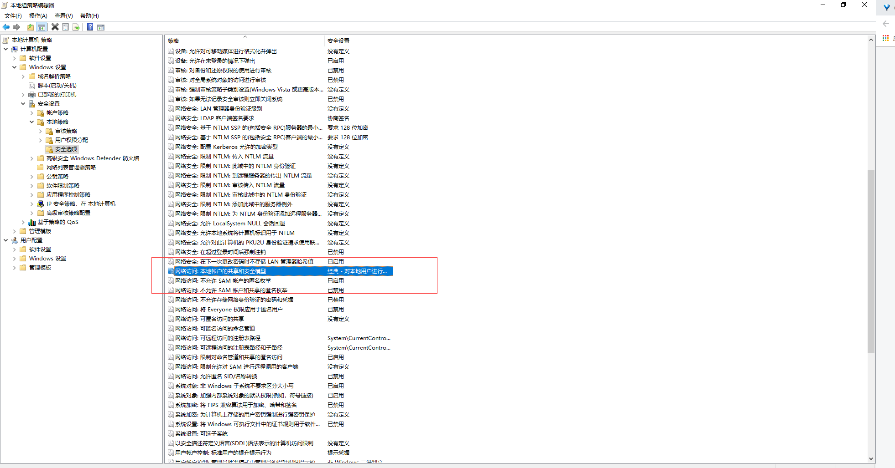

========================================
Docker 在Windows下常见的错误
========================================

Docker for Windows 里的Shared Drives 设置不生效
=======================================================

解决办法：win+R ，键入gpedit.msc，出现如下界面，找到高亮处的网络访问：本地账户的共享和安全模型，选择如图中的 经典 选项。即可。
|image1|

https://blog.csdn.net/u012680857/article/details/77970351